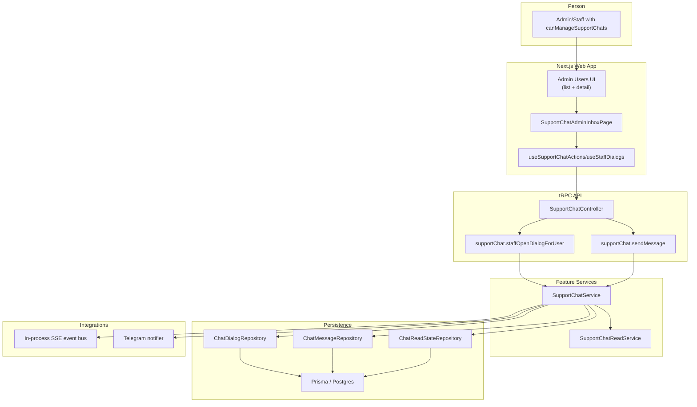
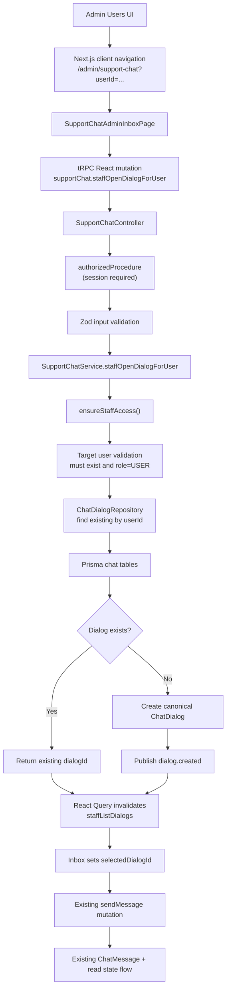
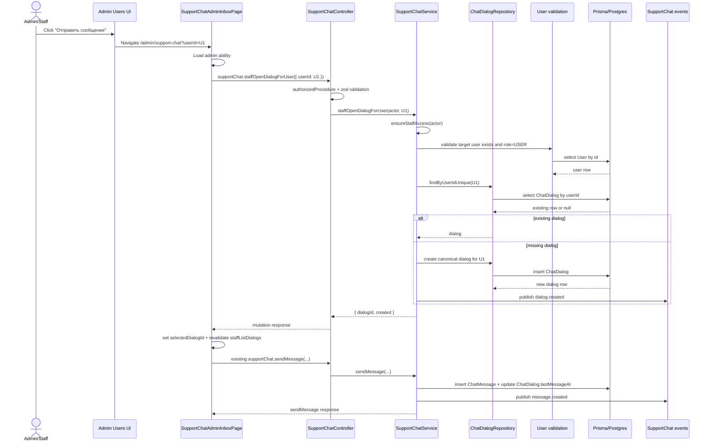
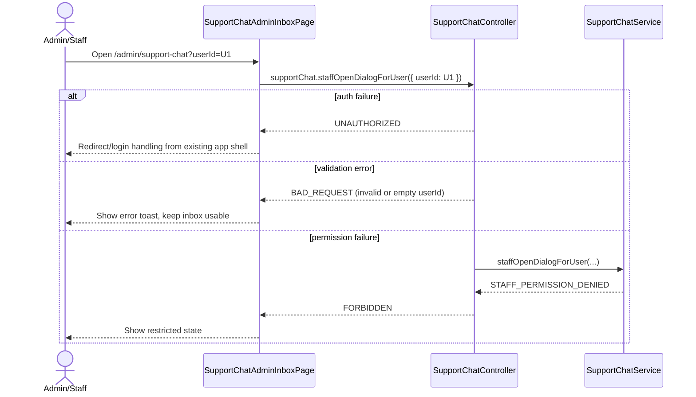
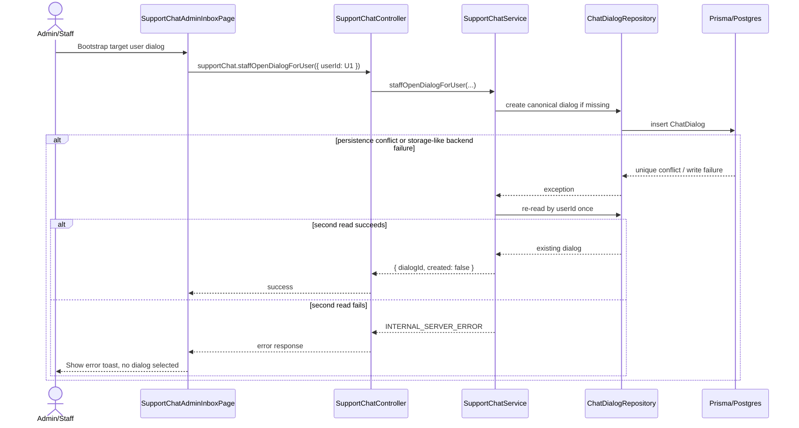

# Design: admin-user-chat

## Summary
The feature adds an admin/staff entrypoint into the existing `support-chat` flow by reusing the current admin inbox UI and extending the support-chat service with a protected staff-side "open or create dialog for user" mutation. The admin users list and user detail surfaces will navigate into `/admin/support-chat` with a target user identifier, the admin chat page will resolve that target through a bootstrap mutation, and the conversation will continue through the existing `sendMessage`, `markDialogRead`, SSE, attachment, and unread-indicator logic. To meet the brief requirement that an existing dialog is reused, the design introduces a canonical single dialog per user constraint.

## Goals
- G1: Allow an actor with `canManageSupportChats` to start a chat with a specific user from the admin users area and land directly in the existing `admin-chat` screen.
- G2: Reuse the current `support-chat` module for message sending, unread tracking, SSE updates, and attachment handling without introducing a second chat implementation.
- G3: Enforce a canonical `admin ↔ user` dialog so the action opens the existing dialog when present and creates one when absent.

## Non-goals
- NG1: Do not redesign the existing admin inbox layout, message rendering, editing, delete rules, or attachment UX.
- NG2: Do not add a new dialog type, group chat model, or per-staff private conversation model.

## Assumptions
Only items not proven by research.
- A1: The product requirement "если диалог уже существует" means a user must have one canonical support dialog for admin/staff communication, even though the current schema allows multiple dialogs.
- A2: Opening the admin chat through a query parameter on `/admin/support-chat` is acceptable for the route contract because no existing route parameter contract is defined for preselection.
- A3: Existing historical duplicate dialogs, if they exist, can be resolved during migration/backfill by selecting one canonical dialog per user and reassigning related rows.

## C4 (Component level)
List components and responsibilities with intended file locations:
- UI (features layer)
  - `src/features/admin-panel/users/_ui/tables/users/columns.tsx`: add an action trigger in the users list that is rendered only when `viewerAbility.canManageSupportChats` is true and links to `/admin/support-chat?userId=<id>`.
  - `src/features/admin-panel/users/_ui/admin-user-profile.tsx`: wire the existing `Отправить сообщение` button to the same route contract and disable/hide it when `viewerAbility.canManageSupportChats` is false.
  - `src/features/support-chat/admin-chat/_ui/support-chat-admin-inbox-page.tsx`: read the optional target `userId` from search params, call a bootstrap action once access is confirmed, and select the resolved dialog in local state.
  - `src/features/support-chat/_vm/use-support-chat.ts`: add a dedicated bootstrap mutation hook that resolves or creates the dialog for a given user and invalidates staff dialog lists.
- API (tRPC routers/procedures)
  - `src/features/support-chat/_controller.ts`: add `supportChat.staffOpenDialogForUser` as a protected mutation under the existing router.
- Services (use-cases)
  - `src/features/support-chat/_services/support-chat-service.ts`: add a staff-side use case that validates staff access, validates target user existence and role, finds an existing dialog by `userId`, or creates the canonical dialog if missing.
- Repositories (entities)
  - `src/entities/support-chat/_repositories/chat-dialog-repository.ts`: add `findByUserIdUnique()` and `upsertCanonicalForUser()` or equivalent repository methods for canonical dialog resolution.
  - `src/entities/user/_repositories/user.ts` or an existing user-domain service already in the `user` entity: reuse an existing user lookup abstraction if needed for target user validation; no support-chat repository imports another entity repository directly.
- Integrations (kernel/shared)
  - `src/app/(admin)/admin/support-chat/page.tsx`: keep the route unchanged; the query parameter is consumed by the client page.
  - `src/features/support-chat/_integrations/support-chat-events.ts`: unchanged; existing `dialog.created` and `message.created` events continue to drive updates.
  - `src/app/api/support-chat/events/route.ts` and `src/app/api/support-chat/attachments/[dialogId]/[attachmentId]/route.ts`: unchanged access model remains valid.
- Background jobs (if any)
  - No new background job is required. Data cleanup/backfill for canonical dialogs is handled in a one-time Prisma migration.

```mermaid
flowchart LR
  UserAction["Admin clicks 'Отправить сообщение'"] --> RouteNav["Navigate to /admin/support-chat?userId=<target>"]
  RouteNav --> AuthBoundary["Auth boundary\nNextAuth session + admin ability query"]
  AuthBoundary --> ValidationBoundary["Validation boundary\nZod userId payload"]
  ValidationBoundary --> TrpcProc["tRPC supportChat.staffOpenDialogForUser"]
  TrpcProc --> Service["SupportChatService.staffOpenDialogForUser"]
  Service --> OwnershipBoundary["Ownership boundary\nstaff permission + target user role"]
  OwnershipBoundary --> Repo["ChatDialogRepository canonical lookup/upsert"]
  Repo --> Prisma["Prisma / Postgres"]
  Prisma --> Service
  Service --> EventBoundary["Integration boundary\noptional dialog.created event on create"]
  EventBoundary --> ClientCache["React Query invalidation + SSE refresh"]
  ClientCache --> InboxState["Admin inbox selects resolved dialog"]
  InboxState --> SendMessage["Existing sendMessage flow"]
```

## Data Flow Diagram (to-be)
- UI -> tRPC client -> Router -> Procedure -> Service -> Repository -> Prisma -> External integrations (if a new dialog is created)
- Validation boundary: query param parsing in the admin inbox client and Zod input validation in `supportChat.staffOpenDialogForUser`
- Auth boundary: `authorizedProcedure` plus existing `ensureStaffAccess()` inside `SupportChatService`
- Ownership boundary: service checks target `userId` belongs to a `USER` account and never accepts arbitrary dialog selection without permission checks
- Integration boundary: `dialog.created` is published only when the bootstrap call creates a new canonical dialog; otherwise no external side effect is required before the first message

## Sequence Diagram (main scenario)
Numbered steps for the main user journey.
Must include auth check, validation, persistence, side effects, and client update.

1. Admin/staff opens the users list or user detail and clicks `Отправить сообщение`.
2. The client navigates to `/admin/support-chat?userId=<targetUserId>`.
3. `SupportChatAdminInboxPage` loads `useAdminAbility()` and confirms `canManageSupportChats`.
4. The page parses `userId` from search params and calls `supportChat.staffOpenDialogForUser` once for that target.
5. `authorizedProcedure` verifies an authenticated session exists.
6. Zod validates `userId` as a non-empty string.
7. `SupportChatService.staffOpenDialogForUser` calls `ensureStaffAccess()` to enforce `ADMIN` or `STAFF` with `canManageSupportChats`.
8. The service validates that the target user exists and has `role === USER`.
9. The service looks up an existing canonical `ChatDialog` by `userId`.
10. If a dialog exists, the service returns that dialog id.
11. If no dialog exists, the service creates `ChatDialog`, publishes `dialog.created`, and returns the new dialog id.
12. The client invalidates `supportChat.staffListDialogs` and selects the returned dialog id in `selectedDialogId`.
13. The existing inbox message query loads messages for that dialog.
14. The admin writes the first message and uses the existing `supportChat.sendMessage` mutation.
15. `SupportChatService.sendMessage` persists `ChatMessage`, updates `lastMessageAt`, recalculates unread state, and publishes `message.created`.
16. User-side unread indicators and staff dialog ordering update through the existing React Query invalidations and SSE flow.

## API contracts (tRPC)
For each procedure:
- Name: `trpc.supportChat.staffOpenDialogForUser`
- Type: mutation
- Auth: protected; allowed for `ADMIN`, or `STAFF` when `canManageSupportChats` is true; target user must exist and have `role === USER`
- Input schema (zod): `{ userId: z.string().min(1) }`
- Output DTO: `{ dialogId: string, userId: string, created: boolean, createdAt: string }`
- Errors: `UNAUTHORIZED` when session is missing; `FORBIDDEN` when actor lacks staff support-chat permission; `NOT_FOUND` when target user does not exist; `BAD_REQUEST` when target user is not a `USER`; `INTERNAL_SERVER_ERROR` for unexpected persistence failures
- Cache: invalidates `supportChat.staffListDialogs`, `supportChat.getUnansweredDialogsCount`; no invalidation for `supportChat.userListDialogs` because no user-visible unread state exists until a message is sent

- Name: `trpc.supportChat.staffListDialogs`
- Type: query
- Auth: unchanged protected staff/admin query with `canManageSupportChats`
- Input schema (zod): unchanged `{ cursor?: string, limit?: number, hasUnansweredIncoming?: boolean }`
- Output DTO: unchanged dialog list DTO
- Errors: unchanged
- Cache: query key remains `supportChat.staffListDialogs`; after bootstrap mutation, force invalidate so the target dialog appears in the list even when newly created

- Name: `trpc.supportChat.sendMessage`
- Type: mutation
- Auth: unchanged protected mutation with dialog access rules (`USER` owner, `ADMIN`, or authorized `STAFF`)
- Input schema (zod): unchanged
- Output DTO: unchanged
- Errors: unchanged
- Cache: unchanged invalidation of `supportChat.userListDialogs`, `supportChat.staffListDialogs`, `supportChat.getUnansweredDialogsCount`, and `supportChat.userGetMessages`

Implementation note for routing:
- The procedure remains inside `SupportChatController` so it reuses the existing feature module and DI bindings.
- The client route contract is `GET /admin/support-chat?userId=<userId>`. The page consumes the query param client-side and does not require a new Next.js route segment.

## Persistence (Prisma)
- Models to add/change
  - Change `ChatDialog` to enforce one canonical dialog per user by adding `@@unique([userId])`.
  - No changes to `ChatMessage`, `ChatAttachment`, or `SupportReadState`.
- Relations and constraints (unique/FK)
  - Existing foreign keys remain unchanged.
  - New unique constraint on `ChatDialog.userId` guarantees the staff bootstrap mutation opens the existing dialog or creates exactly one dialog.
- Indexes
  - Replace the current non-unique `(userId, updatedAt)` access pattern with:
    - `@unique` on `userId` (or `@@unique([userId])`) for canonical lookup
    - keep `@@index([lastMessageAt])` for inbox ordering
  - If list performance by update time is still needed, keep a separate non-unique `@@index([updatedAt])` or `@@index([userId, updatedAt])` only if Prisma supports it alongside the unique key; the unique key is the functional requirement.
- Migration strategy (additive/backfill/cleanup if needed)
  - Step 1: add a migration that identifies duplicate dialogs grouped by `userId`.
  - Step 2: for each duplicated user, keep one canonical dialog (recommended rule: latest `lastMessageAt`, tie-break by latest `createdAt`, final tie-break by smallest `id`).
  - Step 3: reassign `ChatMessage.dialogId`, `ChatAttachment.dialogId`, `ChatAttachment.messageId` remains unchanged, and `SupportReadState.dialogId` from duplicate dialogs into the canonical dialog.
  - Step 4: recompute canonical `ChatDialog.lastMessageAt` from the latest message timestamp after reassignment.
  - Step 5: delete duplicate dialog rows.
  - Step 6: add the unique constraint on `ChatDialog.userId`.
  - Step 7: deploy application code that uses canonical lookup/upsert after the migration lands.

## Caching strategy (React Query)
- Query keys naming: keep existing generated tRPC keys
  - `supportChat.staffListDialogs`
  - `supportChat.userGetMessages`
  - `supportChat.userListDialogs`
  - `supportChat.getUnansweredDialogsCount`
  - `admin.user.permissions`
- Invalidation matrix: mutation -> invalidated queries
  - `supportChat.staffOpenDialogForUser` -> `supportChat.staffListDialogs`, `supportChat.getUnansweredDialogsCount`
  - `supportChat.sendMessage` -> unchanged existing invalidations
  - `supportChat.markDialogRead` -> unchanged existing invalidations
  - `supportChat.editMessage` -> unchanged existing invalidations
  - `supportChat.deleteMessage` -> unchanged existing invalidations
- Cache policy
  - `staffOpenDialogForUser` is a mutation only; no standalone cache entry.
  - `staffListDialogs` continues using `CACHE_SETTINGS.FREQUENT_UPDATE` because it is a frequently changing inbox surface per `docs/caching-strategy.md`.
  - The admin users screens keep their current `staleTime` of 30 seconds; no additional admin-users cache key is required for the chat entry.
- Real-time update strategy
  - If the bootstrap mutation creates a dialog, it publishes `dialog.created`; existing SSE listeners refresh dialog lists.
  - If the bootstrap mutation returns an existing dialog, client-side explicit invalidation is still executed so the page state is consistent even without an event.

## Error handling
- Domain errors vs TRPC errors
  - Extend support-chat domain errors with explicit codes for target user resolution, such as `TARGET_USER_NOT_FOUND` and `TARGET_USER_INVALID_ROLE`, to keep support-chat rules inside the feature domain.
  - Reuse existing `STAFF_PERMISSION_DENIED` for unauthorized admin/staff entry.
- Mapping policy
  - `TARGET_USER_NOT_FOUND` -> `TRPCError({ code: 'NOT_FOUND' })`
  - `TARGET_USER_INVALID_ROLE` -> `TRPCError({ code: 'BAD_REQUEST' })`
  - `STAFF_PERMISSION_DENIED` -> existing `FORBIDDEN`
  - Unexpected repository conflicts during canonical upsert (for example, unique race) -> retry once in service via re-read by `userId`; if still unresolved, return `INTERNAL_SERVER_ERROR`
- Client handling
  - Admin inbox bootstrap failure shows a blocking toast/error state and leaves the dialog list interactive.
  - Invalid target `userId` in URL does not select a dialog; the inbox remains usable for manual selection.

## Security
Threats + mitigations:
- AuthN (NextAuth session usage)
  - Keep `authorizedProcedure` and existing NextAuth session context unchanged.
  - The new bootstrap mutation is not exposed publicly and requires a valid session before any lookup occurs.
- AuthZ (role + ownership checks)
  - Reuse `ensureStaffAccess()` so only `ADMIN` or `STAFF` with `canManageSupportChats` can bootstrap a user dialog from admin surfaces.
  - Validate that the target account has `role === USER`, preventing bootstrap into staff/admin accounts.
- IDOR prevention
  - The route may accept any `userId` in the query string, but the server-side mutation must ignore trust in client navigation and re-check both actor permission and target user role.
  - The returned `dialogId` is still subject to existing `assertDialogAccess()` on every subsequent message/read action.
- Input validation
  - Parse `userId` via `URLSearchParams`, reject empty values client-side, and validate again with Zod server-side.
  - No new free-text inputs are introduced beyond the existing message form.
- Storage security (signed URLs, private buckets, content-type/size limits)
  - No storage model changes.
  - Existing private attachment route, MIME allowlist, and size limits remain the only attachment path.
  - The bootstrap mutation must not upload files or touch storage.
- CSRF
  - Mutations continue to go through same-origin tRPC/NextAuth session flow already used by the app.
  - No new cross-origin callback endpoint is introduced.
- XSS
  - The new entrypoint only moves identifiers (`userId`, `dialogId`) through navigation and tRPC payloads.
  - Message rendering continues to rely on the existing chat UI and should not add raw HTML rendering as part of this feature.
- Secrets handling
  - No new secrets or env vars are introduced.
  - Existing S3/Supabase/Telegram secrets remain confined to server-side code paths.

## Observability
- Logging points (controller/service)
  - Add structured log events in `SupportChatService.staffOpenDialogForUser` for:
    - denied access
    - target user not found
    - existing dialog reused
    - new dialog created
  - Include actor id, target user id, resolved dialog id, and `created` boolean.
- Metrics/tracing if present, else "not in scope"
  - Dedicated metrics/tracing are not in scope; reuse existing application logging only.

## Rollout & backward compatibility
- Feature flags (if needed)
  - No new feature flag is required; the feature remains behind the existing support-chat availability and staff permission model.
  - The UI trigger should only render when `publicConfig.ENABLE_SUPPORT_CHAT` is enabled indirectly through the chat route being available, and when `viewerAbility.canManageSupportChats` is true.
- Migration rollout
  - Run the canonical-dialog backfill migration first.
  - Deploy application code after the unique constraint is in place.
  - Verify existing support-chat pages still load for both users and admins after migration.
- Rollback plan
  - If application code fails after migration, roll back application code while keeping the canonical dialog schema; the old code still functions with one dialog per user.
  - If the migration itself fails before the unique constraint is applied, stop rollout and fix the backfill; do not deploy the bootstrap mutation until canonical data is enforced.
  - If a post-deploy issue occurs, disable access operationally by removing `canManageSupportChats` for staff roles; `ADMIN` access would still remain, so application rollback is the full disable path.

## Alternatives considered
- Alt 1: Reuse the current `createDialog` mutation for staff/admin by broadening it to all roles.
  - Rejected because it overloads a user-originated API contract and mixes two distinct authorization rules into one mutation.
- Alt 2: Keep multiple dialogs per user and add a staff-side query that picks the latest dialog.
  - Rejected because it does not satisfy the brief requirement to open "the existing dialog" deterministically and leaves ambiguity for unread state, routing, and future maintenance.

## Open questions
- Q1: Should the users list add a dedicated visible action column, or is the user detail page entry sufficient for the first release if space in the table is constrained?
- Q2: During duplicate-dialog backfill, should historical messages from merged dialogs remain interleaved chronologically in the canonical dialog without any system marker, or should the migration preserve them silently as plain history?

## Error path sequences

