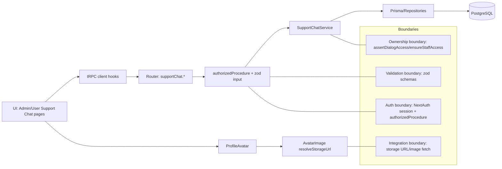
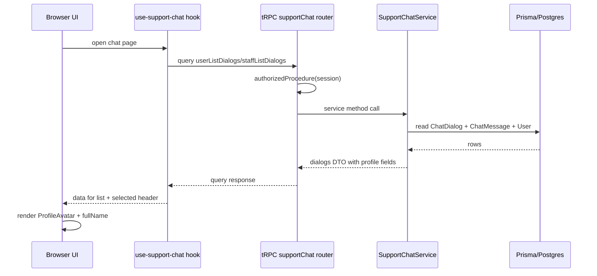
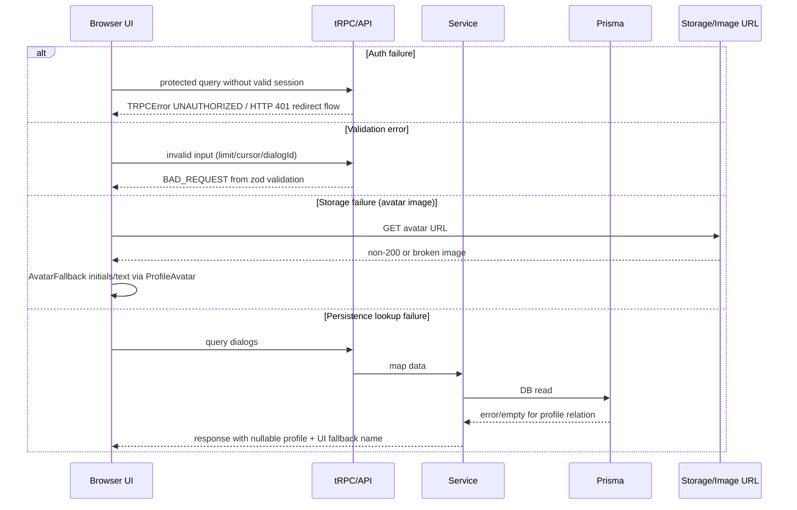

# Design: chat-avatar

## Summary
Добавляем отображение аватара и ФИО в support-chat для двух экранов: список диалогов и шапка чата. Для staff/admin сценария используем уже существующую связь `dialog.user` и расширяем DTO полем `user.image`; для user сценария добавляем в `userListDialogs` профиль сотрудника-ответившего (`counterparty`) по правилу “последний сотрудник, отправивший сообщение в этом диалоге”. Рендер выполняется через существующий `ProfileAvatar`; бизнес-операции чата, SSE, read/unread и права доступа не меняются.

## Goals
- G1: В списке диалогов support-chat показывать `ProfileAvatar` + ФИО рядом с каждым диалогом.
- G2: В header открытого чата показывать `ProfileAvatar` + ФИО рядом с кнопкой “Назад”.
- G3: Сохранить текущие auth/ACL, кэширование React Query и событийную синхронизацию (SSE) без изменения поведения send/edit/delete/read.

## Non-goals
- NG1: Не менять модели Prisma, миграции и storage-провайдеры.
- NG2: Не добавлять новые бизнес-фичи (фильтры, статусы, assignment, редактирование профиля, новый routing).

## Assumptions
- A1: Для user-side “аватар и имя сотрудника, который ответил” определяется как профиль автора последнего сообщения с `senderType=STAFF` в диалоге.
- A2: Если сотрудник в диалоге еще не отвечал, UI использует безопасный fallback имени (`"Пользователь"`) и fallback-рендер `ProfileAvatar`.

## C4 (Component level)
List components and responsibilities with intended file locations:
- UI (features layer)
- `src/features/support-chat/_ui/support-chat-conversation-card.tsx`: добавить API props для header-профиля (`headerProfile`) и отрисовку `ProfileAvatar + fullName` рядом с back button.
- `src/features/support-chat/admin-chat/_ui/support-chat-admin-inbox-page.tsx`: в списке диалогов и в header передавать профиль `dialog.user` (id, name, image).
- `src/features/support-chat/user-chat/_ui/support-chat-user-page.tsx`: брать `counterparty` из user dialogs и передавать в header.
- API (tRPC routers/procedures)
- `src/features/support-chat/_controller.ts`: сигнатуры процедур сохраняются, меняются только DTO-структуры ответов `userListDialogs`/`staffListDialogs`.
- Services (use-cases)
- `src/features/support-chat/_services/support-chat-service.ts`:
- `staffListDialogs`: расширить include/select пользователя полем `image`.
- `userListDialogs`: добавить вычисление `counterparty` (последний STAFF message sender с `id/name/image`).
- Repositories (entities)
- Без изменений контрактов repositories. Используются существующие `ChatDialogRepository`, `ChatMessageRepository`, `ChatReadStateRepository`, `ChatAttachmentRepository`.
- Integrations (kernel/shared)
- `src/entities/user/_ui/profile-avatar.tsx`: используется как единственный компонент аватара.
- `src/features/support-chat/_vm/use-support-chat.ts`: типы hook-результатов автоматически расширяются за счет обновленных tRPC DTO.
- Background jobs (if any)
- Не требуются.

```mermaid
C4Context
    title Context: Chat Avatar in Support Chat
    Person(user, "User")
    Person(staff, "Staff/Admin")
    System_Boundary(app, "Yanasporte Web App") {
      System(chat, "Support Chat", "Next.js + tRPC + Prisma")
    }
    System_Ext(storage, "Storage (MinIO/S3/Supabase)")
    user --> chat : opens profile support chat
    staff --> chat : opens admin support chat inbox
    chat --> storage : loads avatar/image URLs via browser HTTP
```

```mermaid
C4Container
    title Container: Support Chat Avatar Flow
    Person(user, "User/Staff")
    Container(web, "Next.js App", "App Router + React", "Renders chat list/header")
    Container(api, "tRPC API", "@trpc/server", "supportChat router")
    ContainerDb(db, "PostgreSQL", "Prisma", "User/ChatDialog/ChatMessage")
    System_Ext(storage, "Storage", "MinIO in dev, S3/Supabase in prod")
    user --> web : UI interactions
    web --> api : supportChat.userListDialogs/staffListDialogs
    api --> db : read dialogs/messages/users
    web --> storage : avatar image fetch (resolved URL)
```

```mermaid
C4Component
    title Component: To-be components for chat-avatar
    Container_Boundary(feat, "Feature: support-chat") {
      Component(adminUI, "SupportChatAdminInboxPage", "React client", "List item + header avatar/fullName")
      Component(userUI, "SupportChatUserPage", "React client", "Header avatar/fullName from counterparty")
      Component(card, "SupportChatConversationCard", "React client", "Header layout + message list")
      Component(vm, "use-support-chat hooks", "React Query+tRPC", "Dialogs/messages queries and invalidation")
      Component(ctrl, "SupportChatController", "tRPC controller", "Protected procedures")
      Component(svc, "SupportChatService", "Domain service", "Dialog/message DTO mapping")
    }
    Container_Boundary(ent, "Entity: support-chat") {
      Component(repo, "Chat* repositories", "Prisma adapters", "Read/write chat tables")
    }
    adminUI --> card
    userUI --> card
    adminUI --> vm
    userUI --> vm
    vm --> ctrl
    ctrl --> svc
    svc --> repo
```

## Data Flow Diagram (to-be)
- UI -> tRPC client -> Router -> Procedure -> Service -> Repository -> Prisma -> External integrations (if any)



## Sequence Diagram (main scenario)
1. Staff/Admin открывает `/admin/support-chat`, user открывает `/platform/support-chat`.
2. UI вызывает `supportChat.staffListDialogs` или `supportChat.userListDialogs` через React Query hook.
3. tRPC `authorizedProcedure` проверяет наличие session.
4. `SupportChatService` строит list DTO:
5. Для staff: `dialog.user` отдается как `{id,name,image}`.
6. Для user: сервис определяет `counterparty` как автора последнего STAFF сообщения и отдает `{id,name,image}`.
7. UI рендерит список диалогов (аватар + ФИО) и header выбранного диалога через `ProfileAvatar`.
8. SSE/mutations продолжают инвалидировать те же query keys; обновленные DTO перерисовывают header/list без доп. flow.



### Error paths


## API contracts (tRPC)
For each procedure:

- Name: `trpc.supportChat.staffListDialogs`
- Type: `query`
- Auth: protected; roles `ADMIN|STAFF` + `canManageSupportChats` for STAFF (existing rule)
- Input schema (zod): `{ hasUnansweredIncoming?: boolean, cursor?: string, limit: number<=50 }`
- Output DTO (to-be):
- `items[].dialogId: string`
- `items[].user: { id: string; name: string | null; image: string | null }`
- `items[].unreadCount: number`
- `items[].hasUnansweredIncoming: boolean`
- `items[].isUnanswered: boolean`
- `items[].lastMessagePreview: string | null`
- `items[].lastMessageAt: string`
- `nextCursor?: string`
- Errors: `UNAUTHORIZED`, `FORBIDDEN`, `INTERNAL_SERVER_ERROR`
- Cache: key `['supportChat','staffListDialogs',input]`; invalidated by `sendMessage`, `markDialogRead`, `editMessage`, `deleteMessage`, SSE `dialog.created/message.created/message.updated/read.updated`.

- Name: `trpc.supportChat.userListDialogs`
- Type: `query`
- Auth: protected; role `USER` + ownership (`dialog.userId === actor.id`) via existing service checks
- Input schema (zod): `{ cursor?: string, limit: number<=50 }`
- Output DTO (to-be):
- Existing fields: `dialogId`, `title`, `lastMessagePreview`, `unreadCount`, `isUnanswered`, `updatedAt`
- New field: `counterparty: { id: string; name: string | null; image: string | null } | null`
- Errors: `UNAUTHORIZED`, `FORBIDDEN`, `INTERNAL_SERVER_ERROR`
- Cache: key `['supportChat','userListDialogs',input]`; invalidated by existing mutations + SSE events.

- Name: `trpc.supportChat.userGetMessages`
- Type: `query`
- Auth: protected; role+ownership via `assertDialogAccess`
- Input schema (zod): `{ dialogId: string, cursor?: string, limit: number<=50 }`
- Output DTO: без изменений в этом дизайне.
- Errors: `UNAUTHORIZED`, `FORBIDDEN`, `NOT_FOUND`, `INTERNAL_SERVER_ERROR`
- Cache: key `['supportChat','userGetMessages',{dialogId, ...}]`; invalidation без изменений.

## Persistence (Prisma)
- Models to add/change: отсутствуют.
- Relations and constraints: без изменений.
- Indexes: без изменений.
- Migration strategy: миграции не требуются; используется существующая schema (`User.image`, `User.name`, `ChatMessage.senderStaffId`, `ChatDialog.userId`).

## Caching strategy (React Query)
- Query keys naming: использовать текущий trpc/react-query key-space `supportChat.<procedure>(input)`:
- `supportChat.userListDialogs({limit,cursor})`
- `supportChat.staffListDialogs({limit,cursor,hasUnansweredIncoming})`
- `supportChat.userGetMessages({dialogId,limit,cursor})`
- `supportChat.getUnansweredDialogsCount()`
- Invalidation matrix: mutation -> invalidated queries
- `createDialog` -> `userListDialogs`, `getUnansweredDialogsCount`
- `sendMessage` -> `userListDialogs`, `staffListDialogs`, `userGetMessages(dialogId)`, `getUnansweredDialogsCount`
- `markDialogRead` -> `userListDialogs`, `staffListDialogs`, `userGetMessages(dialogId)`, `getUnansweredDialogsCount`
- `editMessage` -> `userListDialogs`, `staffListDialogs`, `userGetMessages(dialogId)`, `getUnansweredDialogsCount`
- `deleteMessage` -> `userListDialogs`, `staffListDialogs`, `userGetMessages(dialogId)`, `getUnansweredDialogsCount`
- SSE `dialog.created/message.created/message.updated/read.updated` -> те же invalidate ветки, как сейчас.

## Error handling
- Domain errors vs TRPC errors:
- Используется текущая модель `SupportChatDomainError` и `mapSupportChatDomainErrorToTrpc`.
- Для avatar/fullName fallback в UI: null-profile не приводит к server error, рендерится fallback name + `ProfileAvatar` fallback.
- Mapping policy:
- Controller сохраняет `runWithErrorMapping` как единый входной контур преобразования ошибок.
- Новые profile поля не должны добавлять новые error codes.

## Security
Threats + mitigations:
- AuthN (NextAuth session usage)
- Без изменений: защищенные процедуры через `authorizedProcedure`, server route guards и session checks.
- AuthZ (role + ownership checks)
- Без изменений: `ensureUserRole`, `ensureStaffAccess`, `assertDialogAccess` остаются источником правил.
- IDOR prevention
- Без изменений: пользователь читает только свои диалоги; staff/admin доступ по permission.
- Input validation
- Без изменений: zod schemas в контроллере; новых input полей нет.
- Storage security (signed URLs, private buckets, content-type/size limits)
- Без изменений: `ProfileAvatar` использует существующий URL-resolution; приватные вложения support-chat остаются через защищенный attachments route.
- Secrets handling
- Без изменений: env-secrets в `privateConfig`; новые секреты не добавляются.
- XSS/CSRF
- XSS: имя пользователя рендерится как текстовый контент React (без `dangerouslySetInnerHTML`).
- CSRF: mutations остаются в текущем tRPC/NextAuth контуре, новых form endpoints не вводится.

## Observability
- Logging points (controller/service)
- Сохраняются существующие логи интеграций (`TelegramSupportNotifier`, SSE warnings).
- Для chat-avatar отдельные новые logging points не требуются.
- Metrics/tracing if present, else "not in scope"
- Not in scope: новые метрики/трейсинг в рамках этой фичи не добавляются.

## Rollout & backward compatibility
- Feature flags (if needed)
- Используется текущий `ENABLE_SUPPORT_CHAT`; отдельный флаг для chat-avatar не требуется.
- Migration rollout
- Нет миграций.
- Rollback plan
- Откат ограничивается возвратом UI и DTO маппинга к предыдущему виду (удаление `image`/`counterparty` из ответов и props).

## Alternatives considered
- Alt 1: Вычислять профиль сотрудника в user header только из `userGetMessages` (без изменений `userListDialogs`).
- Причина отклонения: дублирование вычисления и отсутствие данных для списка диалогов.
- Alt 2: Добавить отдельную процедуру `supportChat.getDialogHeaderProfile`.
- Причина отклонения: дополнительный network roundtrip и лишний контракт при наличии данных в list DTO.

## Open decisions
- D1: Формат fallback имени при `counterparty=null` фиксируем как `"Пользователь"` (из brief) для user и admin UI.

## Open questions
- Q1: Нужна ли локализация fallback имени (например, отдельные тексты для user/admin) или фиксированная строка `"Пользователь"` в обоих контекстах.
