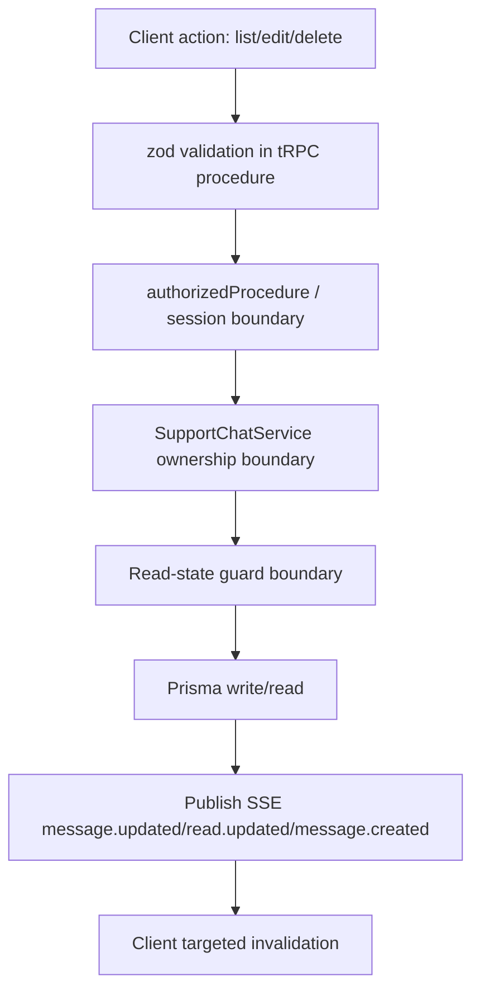
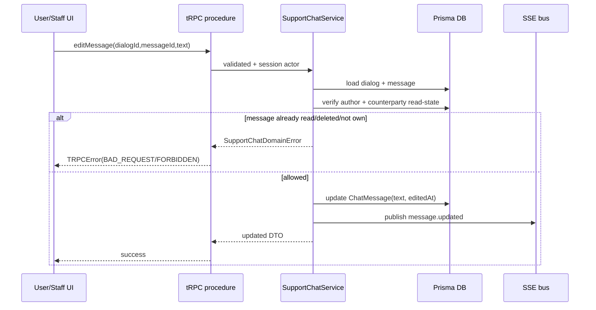

# Design: chat-enhancements

## Summary
Расширение выполняется в существующей архитектуре support-chat: добавляются tRPC-процедуры для aggregate unanswered count и message edit/delete, additive Prisma-поля soft-delete/edit на `ChatMessage`, и UI-обновления для user/admin (бейджи, message actions, адаптивный inbox с infinite scroll и back-navigation на узких экранах). Realtime остается через текущий SSE канал с дополнительным событием `message.updated`.

## Goals
- G1: Показать unanswered badges в admin sidebar и user profile/chat lists.
- G2: Разрешить автору edit/delete сообщения только до чтения другой стороной.
- G3: Обновить admin inbox UX: unresolved сверху, scroll-based lazy loading, mobile back flow.

## Non-goals
- NG1: Не менять auth stack (NextAuth) и transport (tRPC + SSE).
- NG2: Не менять storage lifecycle вложений (no immediate deletion from object storage).

## Assumptions
- A1: Для STAFF-side чтение считается на уровне текущего staff actor (как и текущие `countUnreadForStaff`).
- A2: Для USER-side сообщение считается прочитанным поддержкой, если есть STAFF read-state >= message.createdAt.

## C4 (Component level)
- UI (features/app):
- `support-chat-user-page.tsx`, `support-chat-admin-inbox-page.tsx`, `support-chat-profile-link.tsx`, admin sidebar/nav.
- API (tRPC):
- `SupportChatController` процедуры `getUnansweredDialogsCount`, `editMessage`, `deleteMessage`.
- Services:
- `SupportChatService` (ownership/read-state guard + mutations), `SupportChatReadService` (existing unread helpers).
- Repositories:
- `ChatMessageRepository`, `ChatReadStateRepository`, `ChatDialogRepository`, `ChatAttachmentRepository`.
- Integrations:
- SSE event bus + route, Telegram notifier, file storage providers.
- Background jobs:
- Existing attachment cleanup/backfill scripts remain unchanged.

```mermaid
flowchart LR
  UserUI[User/Profile/Admin UI] --> TRPCClient[tRPC React Client]
  TRPCClient --> Router[SupportChatController]
  Router --> Service[SupportChatService]
  Service --> Repo1[ChatDialogRepository]
  Service --> Repo2[ChatMessageRepository]
  Service --> Repo3[ChatReadStateRepository]
  Repo1 --> Prisma[(Postgres via Prisma)]
  Repo2 --> Prisma
  Repo3 --> Prisma
  Service --> SSE[Support Chat Event Bus]
  SSE --> SSEApi[/api/support-chat/events]
  SSEApi --> UserUI
```

## Data Flow Diagram (to-be)


## Sequence Diagram (main scenario)


## API contracts (tRPC)
- Name: `trpc.supportChat.getUnansweredDialogsCount`
- Type: `query`
- Auth: `protected`; USER only own dialogs; STAFF/ADMIN via `ensureStaffAccess`.
- Input: none.
- Output DTO: `{ count: number }`.
- Errors: `FORBIDDEN` for missing staff permissions.
- Cache: invalidated on send/read/edit/delete + SSE events.

- Name: `trpc.supportChat.editMessage`
- Type: `mutation`
- Auth: `protected` + ownership (`senderUserId`/`senderStaffId` == actor).
- Input: `{ dialogId: string; messageId: string; text: string<=4000 }`.
- Output DTO: `{ id; dialogId; text; editedAt }`.
- Errors: `NOT_FOUND`, `FORBIDDEN`, `BAD_REQUEST` (`already read/deleted`).
- Cache: invalidate messages for dialog + dialog lists + unanswered count.

- Name: `trpc.supportChat.deleteMessage`
- Type: `mutation`
- Auth: `protected` + ownership + unread-by-counterparty.
- Input: `{ dialogId: string; messageId: string }`.
- Output DTO: `{ id; dialogId; deletedAt; deletedBy }`.
- Errors: `NOT_FOUND`, `FORBIDDEN`, `BAD_REQUEST`.
- Cache: same invalidation matrix as `editMessage`.

## Persistence (Prisma)
- Models to change:
- `ChatMessage`: add `editedAt DateTime?`, `deletedAt DateTime?`, `deletedBy String?`.
- Migration strategy:
- Additive migration (`ALTER TABLE ChatMessage ADD COLUMN ...`) без backfill.
- Existing data compatibility:
- Legacy rows keep null values; UI interprets null as not edited/not deleted.

## Caching strategy (React Query)
- Query keys naming remains by existing trpc hooks:
- `supportChat.userListDialogs`, `supportChat.staffListDialogs`, `supportChat.userGetMessages`, `supportChat.getUnansweredDialogsCount`.
- Invalidation matrix:
- `sendMessage`, `markDialogRead`, `editMessage`, `deleteMessage` -> invalidate dialog lists + message thread + unanswered count.
- SSE events `dialog.created`, `message.created`, `message.updated`, `read.updated` -> same targeted invalidation.

## Error handling
- Domain errors extend existing `SupportChatErrorCode` (`MESSAGE_ACTION_FORBIDDEN`, `MESSAGE_ALREADY_READ`, `MESSAGE_ALREADY_DELETED`).
- Mapping remains centralized in `error-mapping.ts` -> `TRPCError` codes.

## Security
- AuthN: unchanged NextAuth session + `authorizedProcedure`.
- AuthZ: service-level ownership checks for edit/delete; dialog access checks reused.
- IDOR prevention: edit/delete always scoped by `(dialogId,messageId)` + actor checks.
- Input validation: zod schemas for new procedures.
- Storage security: unchanged private attachment route and rate-limits.
- CSRF/XSS: unchanged pattern (same API surface, escaped React rendering).

## Observability
- Existing logger + SSE event flow reused; no new logging pipeline.

## Rollout & backward compatibility
- Feature rollout:
- Deploy migration first, then app code.
- Rollback:
- App rollback is safe because new columns are additive and nullable.

## Alternatives considered
- Alt 1: отдельная unread-badge REST endpoint. Rejected: duplicate transport vs existing tRPC.
- Alt 2: hard-delete messages. Rejected: conflicts with history-preservation requirement.

## Open questions
- Q1: Для ADMIN unread-by-support считается per-admin reader state (текущее поведение). Это сохранено.
