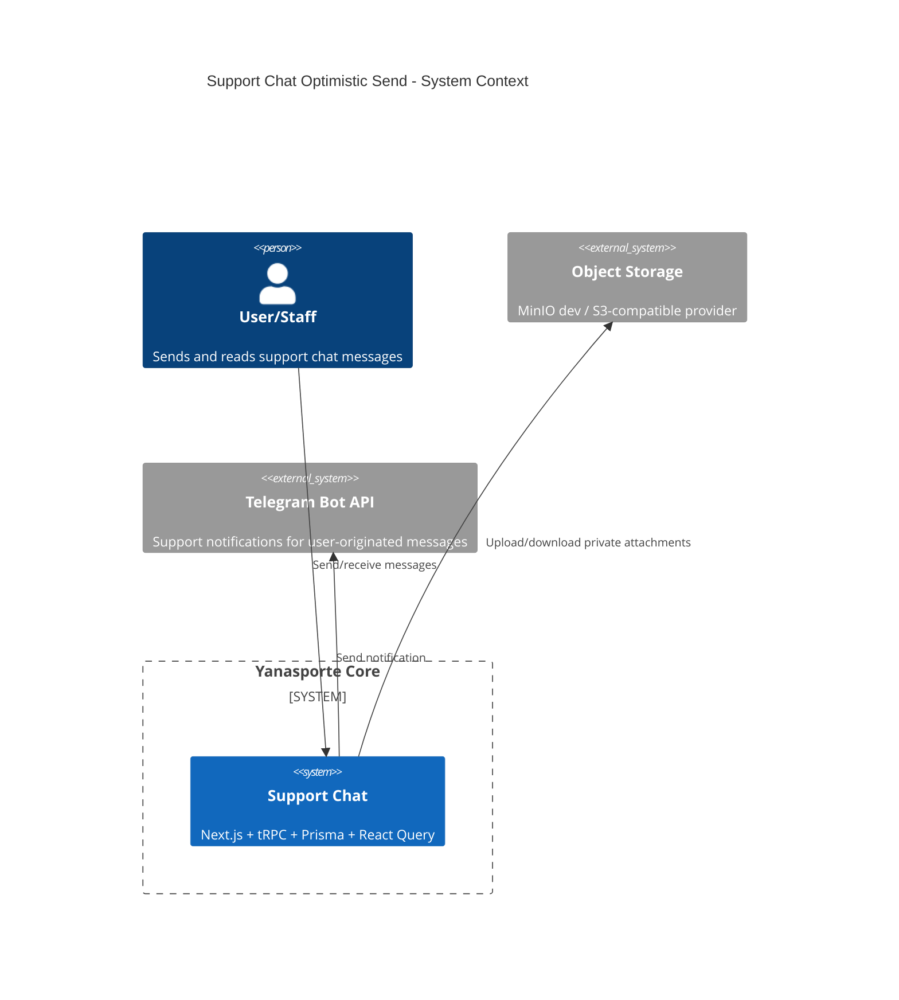
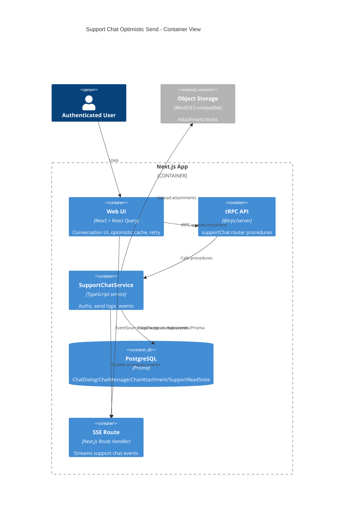
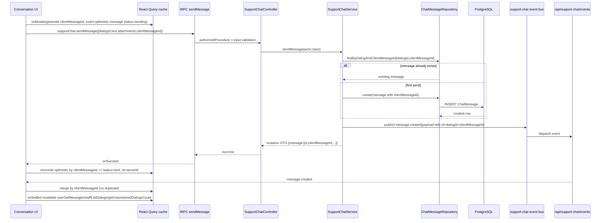
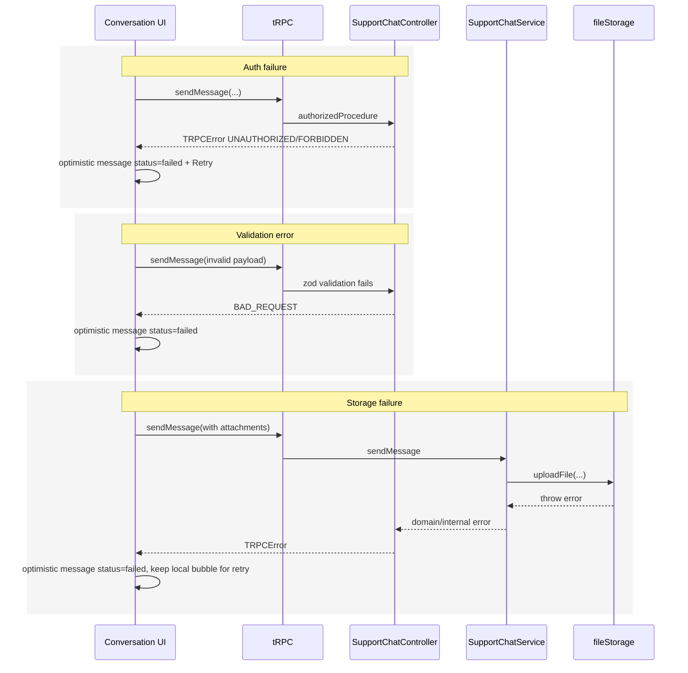

# Design: chat-optimistic-update

## Summary
Добавляется internal correlation id `clientMessageId` для сообщений support-chat, чтобы объединить optimistic UI, серверный ответ мутации, SSE-события и refetch React Query в один согласованный lifecycle (`sending -> sent -> failed`) без визуальных дублей. Изменения ограничены текущим модулем чата (`tRPC + service + Prisma + SSE + client hooks/components`) и сохраняют существующую auth/ACL, DI и storage архитектуру.

## Goals
- G1: После отправки сообщение отображается мгновенно в UI со статусом `sending` и без ожидания network round-trip.
- G2: Сообщения дедуплицируются между optimistic cache, mutation response, SSE и refetch по `clientMessageId`.
- G3: Серверный контракт обратно совместим: `clientMessageId` optional на входе, но возвращается в DTO при наличии/генерации.

## Non-goals
- NG1: Переписывать transport с SSE на WebSocket/pub-sub.
- NG2: Менять существующие role/permission правила (`ADMIN/STAFF/USER`, `canManageSupportChats`).

## Assumptions
- A1: `clientMessageId` используется только внутри этого репозитория и не является публичным API-контрактом с внешними клиентами.
- A2: Для legacy-клиентов без `clientMessageId` сервер может генерировать значение, чтобы унифицировать downstream DTO/SSE payload.

## Constraints recap
- FSD layering: `shared -> entities -> features -> app`.
- Нет cross-entity repository imports.
- DI через существующие Inversify modules.
- API через tRPC v11.
- Auth через NextAuth session.
- React Query policy по `docs/caching-strategy.md`.
- Storage behavior (MinIO dev / S3-compatible prod provider strategy) не меняется.

## Primary scenarios
1. User/staff отправляет сообщение, видит optimistic bubble (`sending`), затем reconciliation до `sent`.
2. Сервер принимает повторную отправку с тем же `clientMessageId` и возвращает уже существующую запись (idempotent send).
3. Ошибка отправки помечает optimistic bubble как `failed`; retry использует тот же `clientMessageId`.
4. SSE событие приходит до mutation success и выполняет merge по `clientMessageId` без дубля.

## C4 (Context level)


## C4 (Container level)


## C4 (Component level)
```mermaid
flowchart LR
  subgraph UI[features/support-chat client components]
    A[SupportChatUserPage/AdminInboxPage]
    B[useSupportChatActions]
    C[useDialogMessages/useStaffDialogMessages]
    D[Optimistic message mapper]
  end

  subgraph API[tRPC]
    E[SupportChatController.sendMessage]
    F[sendMessageInputSchema]
  end

  subgraph Domain[features/support-chat services]
    G[SupportChatService.sendMessage]
    H[Idempotency resolver by clientMessageId]
    I[publishSupportChatEvent]
  end

  subgraph Entities[entities/support-chat repositories]
    J[ChatMessageRepository]
    K[ChatDialogRepository]
    L[ChatAttachmentRepository]
  end

  subgraph Infra[app/shared]
    M[(Prisma ChatMessage)]
    N[/api/support-chat/events]
    O[fileStorage]
  end

  A --> B --> D --> E
  E --> F --> G
  G --> H --> J --> M
  G --> K
  G --> L
  G --> O
  G --> I --> N
  C --> A
```

## C4 (Component level details)
- UI (features layer):
  - `src/features/support-chat/_vm/use-support-chat.ts`
  - `src/features/support-chat/_ui/support-chat-conversation-card.tsx`
  - `src/features/support-chat/user-chat/_ui/support-chat-user-page.tsx`
  - `src/features/support-chat/admin-chat/_ui/support-chat-admin-inbox-page.tsx`
  - Responsibility: optimistic insert/merge/status transitions, retry, SSE reconciliation.
- API (tRPC routers/procedures):
  - `src/features/support-chat/_controller.ts` (`supportChat.sendMessage`, `userGetMessages`, optional DTO parity for staff list preview when needed).
  - Responsibility: input validation, auth boundary, service call, error mapping.
- Services (use-cases):
  - `src/features/support-chat/_services/support-chat-service.ts`
  - Responsibility: access check, idempotent message create-by-clientMessageId, side effects.
- Repositories (entities):
  - `src/entities/support-chat/_repositories/chat-message-repository.ts`
  - Responsibility: find/create by `(dialogId, clientMessageId)`, list DTO fields including `clientMessageId`.
- Integrations (kernel/shared):
  - `src/features/support-chat/_integrations/support-chat-events.ts`
  - `src/app/api/support-chat/events/route.ts`
  - Responsibility: publish typed payload with message correlation data.
- Background jobs:
  - Not in scope for this feature.

## Data Flow Diagram (to-be)
```mermaid
flowchart TD
  U[UI submit] --> V[onMutate: generate clientMessageId + optimistic cache write]
  V --> W[tRPC supportChat.sendMessage]
  W --> X[Validation boundary: zod schema]
  X --> Y[Auth boundary: authorizedProcedure + assertDialogAccess]
  Y --> Z[Ownership boundary: dialog actor check]
  Z --> S[Service sendMessage with idempotency]
  S --> R[Repository find/create by dialogId+clientMessageId]
  R --> P[(Prisma ChatMessage)]
  S --> Q[Integration boundary: publish SSE event + Telegram + storage]
  Q --> E[/api/support-chat/events]
  E --> C[EventSource listener]
  C --> M[Merge by clientMessageId into query cache]
  W --> N[onSuccess reconcile optimistic message]
  W --> O[onError mark failed + retry action]
  N --> T[onSettled invalidate queries]
  M --> T
```

## Sequence Diagram (main scenario)


## Sequence Diagram (error paths)


## API contracts (tRPC)
- Name: `trpc.supportChat.sendMessage`
- Type: mutation
- Auth: protected; ownership via `assertDialogAccess`, staff permission via existing checks.
- Input schema (zod):
  - `dialogId: string`
  - `text?: string`
  - `attachments?: SupportChatAttachmentInput[]`
  - `clientMessageId?: string` (optional for backward compatibility).
- Output DTO:
  - `message: { id: string; dialogId: string; senderType: 'USER' | 'STAFF'; text: string | null; attachments: unknown; createdAt: string; clientMessageId: string }`
  - `dialog: { dialogId: string; updatedAt: string }`
  - `unread: { user: number; staff: number }`
- Errors:
  - `UNAUTHORIZED`, `FORBIDDEN`, `BAD_REQUEST`, `NOT_FOUND`, `INTERNAL_SERVER_ERROR`.
- Cache:
  - optimistic local insert on mutate for current `userGetMessages({dialogId})`.
  - onSettled invalidate `supportChat.userGetMessages({dialogId})`, `supportChat.staffListDialogs`, `supportChat.getUnansweredDialogsCount`, `supportChat.userListDialogs`.

- Name: `trpc.supportChat.userGetMessages`
- Type: query
- Auth: protected + dialog ownership/role check.
- Input schema (zod): unchanged pagination + `dialogId`.
- Output DTO change:
  - each message includes `clientMessageId: string | null`.
- Errors: unchanged (`NOT_FOUND`, `FORBIDDEN`, etc.).
- Cache:
  - query key unchanged `supportChat.userGetMessages({dialogId,limit,cursor})`.

- Name: `trpc.supportChat.staffListDialogs` and `trpc.supportChat.userListDialogs`
- Type: query
- Auth: unchanged.
- Input schema: unchanged.
- Output DTO:
  - no mandatory structural change; optional preview enrichment by `lastMessageClientMessageId` is out of scope unless needed by UI in this phase.
- Cache: unchanged keys and invalidation.

- Name: SSE event `message.created` (internal app route contract)
- Type: server-sent event
- Auth: existing session + route ACL.
- Payload (to-be):
  - `type: 'message.created'`
  - `dialogId: string`
  - `userId: string`
  - `occurredAt: string`
  - `message: { id: string; clientMessageId: string; text: string | null; senderType: 'USER' | 'STAFF'; createdAt: string }`
- Compatibility:
  - client merge logic accepts old payload (without `message`) and falls back to invalidation-only behavior.

## Persistence (Prisma)
- Models to change:
  - `ChatMessage`: add column `clientMessageId String?`.
- Relations and constraints:
  - Add unique composite `@@unique([dialogId, clientMessageId])`.
  - Keep nullable field for backward compatibility with historical rows and legacy calls.
- Indexes:
  - unique composite index above serves idempotency lookup.
  - existing indexes remain.
- Migration strategy:
  1. Add nullable `clientMessageId` column.
  2. Backfill existing rows with generated stable values (e.g., `legacy_<id>`) to satisfy unique composite for non-null rows if needed.
  3. Add unique constraint on `(dialogId, clientMessageId)` with nullable semantics.
  4. Keep write-path tolerant: if input misses id, server generates one before insert.

## Caching strategy (React Query)
- Query keys naming:
  - `supportChat.userListDialogs({limit,cursor})`
  - `supportChat.staffListDialogs({limit,cursor,hasUnansweredIncoming})`
  - `supportChat.userGetMessages({dialogId,limit,cursor})`
  - `supportChat.getUnansweredDialogsCount()`
- Local optimistic message shape (client-only):
  - `{ id: clientMessageId, clientMessageId, status: 'sending' | 'sent' | 'failed', ...server message fields }`
- Invalidation matrix:
  - `sendMessage` -> invalidate `userGetMessages(dialogId)`, `userListDialogs`, `staffListDialogs`, `getUnansweredDialogsCount`.
  - `createDialog` -> unchanged existing invalidations.
  - `markDialogRead/editMessage/deleteMessage` -> unchanged existing invalidations.
  - SSE `message.created` -> merge by `clientMessageId` when available; then invalidate same keys as current behavior.
- Cache profile:
  - Keep `CACHE_SETTINGS.FREQUENT_UPDATE` for dialogs/messages/unanswered count.

## Error handling
- Domain errors vs TRPC errors:
  - Reuse existing `SupportChatDomainError` and mapping in `mapSupportChatDomainErrorToTrpc`.
  - Add explicit handling for duplicate key race (P2002 on `(dialogId,clientMessageId)`) in service/repository: resolve existing message and return success DTO (idempotent outcome).
- Mapping policy:
  - Validation/input issues -> `BAD_REQUEST`.
  - Access violations -> `FORBIDDEN`/`UNAUTHORIZED`.
  - Missing dialog/message -> `NOT_FOUND`.
  - Unexpected storage/infrastructure failures -> `INTERNAL_SERVER_ERROR`.

## Security
- AuthN (NextAuth session usage):
  - No changes: `authorizedProcedure` + `getServerSession` in routes remain source of identity.
- AuthZ (role + ownership checks):
  - No changes: `assertDialogAccess` and `ensureStaffAccess` remain authoritative.
- IDOR prevention:
  - Message correlation does not replace dialog access checks; idempotency lookup is scoped by `dialogId`.
- Input validation:
  - `clientMessageId` validated in zod (string min length, max length, format-safe charset).
  - Existing text/attachment limits remain.
- Storage security:
  - Existing private bucket upload and guarded download route unchanged.
- XSS/CSRF:
  - Text rendering remains as plain text (no HTML injection path introduced).
  - tRPC mutations continue same-origin/authenticated session path.
- Secrets handling:
  - No new secrets; existing env config only.

## Observability
- Logging points:
  - Service log on idempotent dedupe hit (`existing message reused`).
  - Existing warning logs for Telegram/storage/SSE enqueue remain.
- Metrics/tracing:
  - Not in scope (current codebase has no dedicated metrics pipeline for support-chat).

## Rollout & backward compatibility
- Feature flags:
  - Existing support-chat feature flag remains (`ENABLE_SUPPORT_CHAT`), additional flag not required.
- Migration rollout:
  1. Deploy migration adding `clientMessageId` + unique composite.
  2. Deploy server with optional input and response/SSE payload enrichment.
  3. Deploy client optimistic logic that always sends `clientMessageId`.
- Backward compatibility:
  - Old clients without `clientMessageId` remain supported by optional input and server-side generation.
  - New clients can handle both old/new SSE payload shapes.
- Rollback plan:
  - Roll back client first (server remains backward-compatible).
  - If server rollback is required, keep DB column/constraint (additive) and disable optimistic merge path in client.

## Alternatives considered
- Alt 1: Keep invalidation-only approach (no optimistic state machine).
  - Rejected: does not satisfy immediate message render requirement.
- Alt 2: Correlate by server-generated id only.
  - Rejected: server id недоступен в момент optimistic render и не решает dedupe до round-trip.

## Open decisions
- D1: Зафиксировать формат server-generated fallback для `clientMessageId` (например, `srv_<cuid>`), чтобы он не конфликтовал с client-префиксом `tmp_`.
- D2: Утвердить финальный минимальный состав `message.created` SSE payload для merge (полный message объект vs только `id/clientMessageId/dialogId`).
- D3: `failed` optimistic сообщения не удаляются по TTL; остаются до действия пользователя (Retry или optional delete).
- D4: `clientMessageId` добавляется только на уровне message DTO; в dialog preview DTO поле не добавляется.

## Open questions
- Нет открытых вопросов после согласования решений по Q1/Q2.
