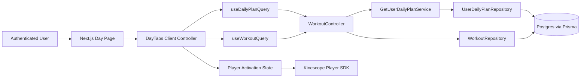
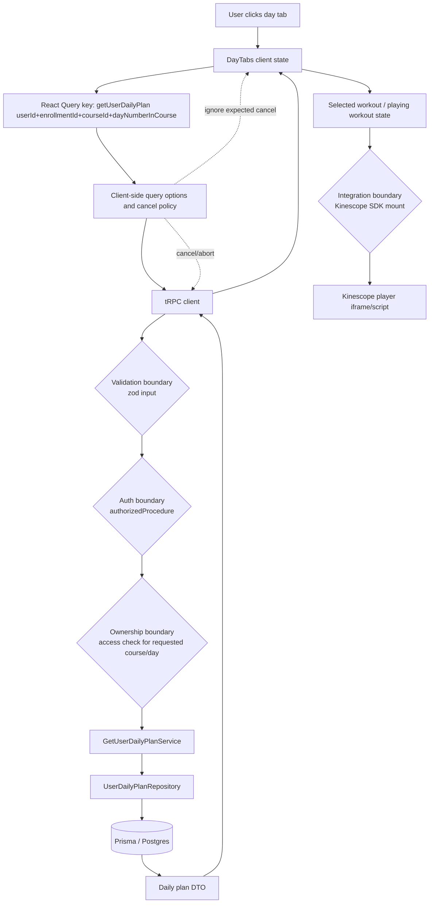
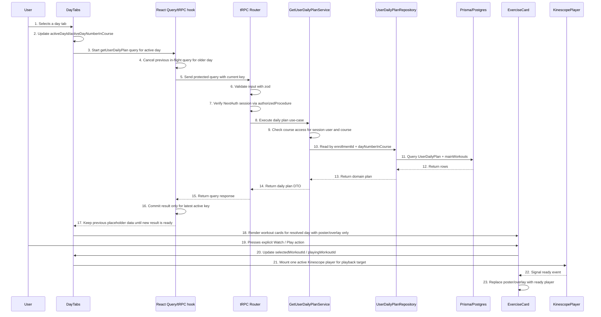
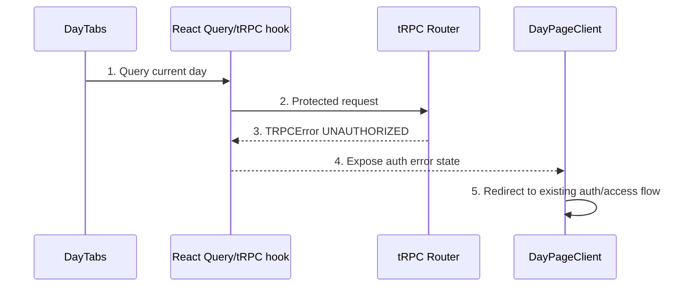
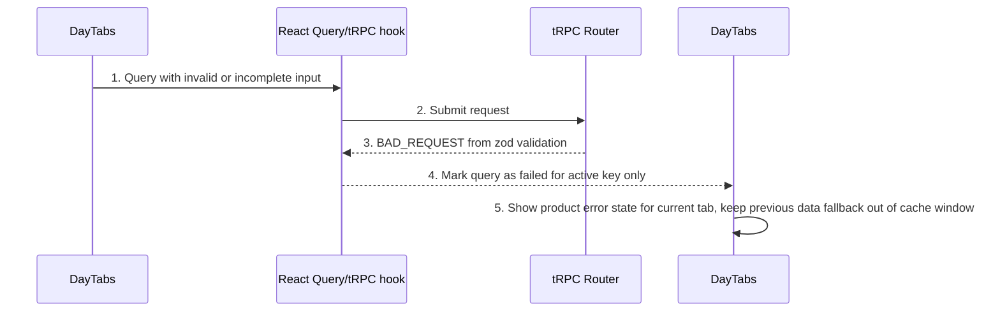
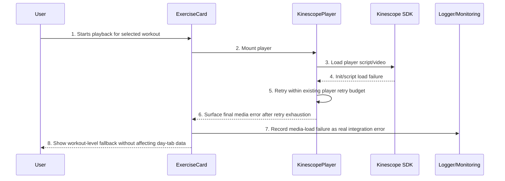

# Design: day-tab-query-race

## Summary
The day page will keep `activeDay` as the only source of truth for day-level data loading, move request cancellation and expected-abort handling into the day-query path, and decouple player lifecycle from tab switching by separating tab selection from explicit playback intent. The design keeps the existing Next.js, tRPC, NextAuth, React Query, and Inversify architecture, avoids Prisma changes, and focuses on predictable query ownership, stable UI fallback behavior, and controlled Kinescope player mounting only after a user presses `Watch` / `Play`.

## Goals
- G1: Prevent stale or canceled day-tab requests from producing user-visible error states or noisy operational logs.
- G2: Ensure the rendered day content always corresponds to the latest selected tab and does not get overwritten by slower older responses.
- G3: Reduce unnecessary Kinescope player mounts during rapid tab switching while preserving responsive navigation and existing business behavior.

## Non-goals
- NG1: Redesign the paid day page layout, enrollment logic, or course access model.
- NG2: Change Prisma schema, course scheduling rules, or workout completion business semantics.
- NG3: Introduce a new data transport outside tRPC and React Query.

## Assumptions
Only items not proven by research.
- A1: The generated tRPC React Query hooks support passing per-query tRPC options such as `trpc.abortOnUnmount` through the existing client integration.
- A2: Existing logging sinks can safely filter a dedicated expected-cancel marker without changing infrastructure ownership.

## C4 (Component level)
List components and responsibilities with intended file locations:
- UI (features layer)
  - `src/features/daily-plan/_ui/calendar-tabs.tsx`: owns active week navigation and passes active-week state into the day-tab controller component.
  - `src/features/daily-plan/_ui/day-tabs.tsx`: owns `activeDayId`/`activeDayNumberInCourse`, triggers the day query, renders stable loading states, and coordinates `selectedWorkoutId` and `playingWorkoutId` independently from tab selection.
  - `src/features/daily-plan/_ui/exercise-card.tsx`: renders workout metadata, poster/overlay state, completion controls, and an explicit `Watch` / `Play` action that is the only allowed trigger for player activation.
  - `src/features/daily-plan/_ui/kinescope-player.tsx`: renders the player only for the explicit playback target, keeps poster replacement gated by player readiness, and reports recoverable media-load failures to the parent.
- API (tRPC routers/procedures)
  - `src/features/daily-plan/_controller.ts`: keeps `getUserDailyPlan` and `getWorkout` as protected tRPC read procedures; adds explicit error mapping for expected cancel and validation/auth failures where applicable.
- Services (use-cases)
  - `src/features/daily-plan/_services/get-user-daily-plan.ts`: remains the read use-case for daily plan lookup, with structured logging that differentiates expected request abort from domain/server failures.
  - `src/features/daily-plan/_services/day-plan-load.ts`: remains the RSC bootstrap path for initial hydration of the default day.
- Repositories (entities)
  - `src/entities/course/_repositories/user-daily-plan.ts`: remains the source of persisted day plans keyed by `(enrollmentId, dayNumberInCourse)`.
  - `src/entities/workout/_repositories/workout.ts`: remains the source of workout and `videoId` metadata.
- Integrations (kernel/shared)
  - `src/kernel/lib/trpc/client.ts` and `src/app/_providers/app-provider.tsx`: continue to host the shared tRPC client and React Query provider; query-level abort behavior is configured from feature hooks instead of a parallel fetch stack.
  - `src/shared/lib/cache/cache-constants.ts`: remains the source for query freshness defaults.
  - `src/shared/lib/logger.ts`: remains the structured logger interface.
- Background jobs (if any)
  - None. This design introduces no background job or async worker.

## Data Flow Diagram (to-be)
- UI -> tRPC client -> Router -> Procedure -> Service -> Repository -> Prisma -> External integrations (if any)

Include:
- Validation boundary
- Auth boundary
- Ownership boundary
- Integration boundary

## Sequence Diagram (main scenario)
Numbered steps for the main user journey.
Must include auth check, validation, persistence, side effects, and client update.

### Error path: auth failure

### Error path: validation error

### Error path: storage/media failure

## API contracts (tRPC)
For each procedure:
- Name: `trpc.<router>.<procedure>`
- Type: query/mutation
- Auth: public/protected + role/ownership rules
- Input schema (zod): fields
- Output DTO: fields
- Errors: codes and cases
- Cache: query keys + invalidation plan

- Name: `trpc.workout.getUserDailyPlan`
  - Type: query
  - Auth: protected; authenticated user only; ownership rule is course access for the effective session user and requested enrollment/course pair.
  - Input schema (zod): `userId: string`, `enrollmentId: string`, `courseId: string`, `dayNumberInCourse: number`.
  - Output DTO: `null | { id, warmupId, warmupStepIndex, isWorkoutDay, mainWorkouts: Array<{ order, workoutId, stepIndex }>, mealPlanId?, weekNumber?, originalDailyPlanId? }`.
  - Errors: `UNAUTHORIZED` when session is missing; `BAD_REQUEST` for malformed input; `FORBIDDEN` when access check fails if controller/service is hardened to map access denial explicitly; `INTERNAL_SERVER_ERROR` for repository/server failure; canceled client request is treated as expected cancel and is not surfaced as a product error.
  - Cache: query key remains procedure-scoped with full input object `{ userId, enrollmentId, courseId, dayNumberInCourse }`; keep `placeholderData(previousData)`; enable abort-on-unmount / superseded-request cancellation at the query options layer; no invalidation on tab switch because key changes.

- Name: `trpc.workout.getWorkout`
  - Type: query
  - Auth: protected; authenticated user only; ownership rule remains course-access-dependent through existing route context and surrounding UI flow.
  - Input schema (zod): `workoutId: string`.
  - Output DTO: `null | { id, title, description, videoId, durationSec, poster, posterUrl, difficulty, equipment, muscles, section, subsections }`.
  - Errors: `UNAUTHORIZED`, `BAD_REQUEST`, `INTERNAL_SERVER_ERROR`.
  - Cache: query key remains `{ workoutId }`; keep frequent-update cache; load only workouts visible for the committed active day; player mount remains blocked until explicit user action.

- Name: `trpc.workout.getWorkoutCompletionStatus`
  - Type: query
  - Auth: protected; authenticated user only; ownership rule is enrollment ownership for session user.
  - Input schema (zod): `userId: string`, `workoutId: string`, `enrollmentId: string`, `contentType: enum DailyContentType`, `stepIndex: number`.
  - Output DTO: `boolean`.
  - Errors: `UNAUTHORIZED`, `BAD_REQUEST`, `INTERNAL_SERVER_ERROR`.
  - Cache: query key remains full completion identity; invalidated by `updateWorkoutCompletion`.

- Name: `trpc.workout.updateWorkoutCompletion`
  - Type: mutation
  - Auth: protected; authenticated user only; ownership rule is enrollment ownership for session user.
  - Input schema (zod): `userId: string`, `workoutId: string`, `enrollmentId: string`, `contentType: enum DailyContentType`, `stepIndex: nonnegative int`, `isCompleted: boolean`.
  - Output DTO: `{ success: true }`.
  - Errors: `UNAUTHORIZED`, `BAD_REQUEST`, `FORBIDDEN` for ownership/access denial, `INTERNAL_SERVER_ERROR`.
  - Cache: invalidate exact completion-status query; optional invalidate current day query only if completion badges on the day screen must be recomputed from server data.

- Name: `trpc.course.getAvailableWeeks`
  - Type: query
  - Auth: protected; authenticated user only; ownership rule is course enrollment ownership for session user.
  - Input schema (zod): `userId: string`, `courseSlug: string`.
  - Output DTO: `{ availableWeeks: number[], totalWeeks: number, currentWeekIndex: number, weeksMeta?: Array<{ weekNumber, releaseAt }>, maxDayNumber?: number, totalDays?: number }`.
  - Errors: `UNAUTHORIZED`, `BAD_REQUEST`, `FORBIDDEN`, `INTERNAL_SERVER_ERROR`.
  - Cache: frequent-update; invalidated only on enrollment/workout-day configuration changes.

## Persistence (Prisma)
- Models to add/change
  - None. The design uses existing `UserDailyPlan`, `UserDailyMainWorkout`, `Workout`, and `UserWorkoutCompletion` models without schema changes.
- Relations and constraints (unique/FK)
  - Continue to rely on `UserDailyPlan @@unique([enrollmentId, dayNumberInCourse])` for day lookup.
  - Continue to rely on `UserWorkoutCompletion @@unique([userId, enrollmentId, contentType, workoutId, stepIndex])` for completion status.
- Indexes
  - Existing indexes are sufficient for this design because requests remain keyed by current enrollment/day and workout id.
- Migration strategy (additive/backfill/cleanup if needed)
  - No Prisma migration required.

## Caching strategy (React Query)
- Query keys naming: Define full naming convention
  - Day data: `workout.getUserDailyPlan({ userId, enrollmentId, courseId, dayNumberInCourse })`.
  - Workout data: `workout.getWorkout({ workoutId })`.
  - Completion data: `workout.getWorkoutCompletionStatus({ userId, workoutId, enrollmentId, contentType, stepIndex })`.
  - Enrollment/week metadata: existing `course.getEnrollment`, `course.getEnrollmentByCourseSlug`, `course.getAvailableWeeks`, `course.checkAccessByCourseSlug`.
- Invalidation matrix: mutation -> invalidated queries
  - `workout.updateWorkoutCompletion` -> invalidate exact `workout.getWorkoutCompletionStatus(...)`.
  - `course.updateWorkoutDays` -> invalidate `course.getUserEnrollments`, `course.getActiveEnrollment`, `course.getAccessibleEnrollments`, `course.getEnrollment`, `course.getEnrollmentByCourseSlug`, `course.getAvailableWeeks`, and all `workout.getUserDailyPlan` entries for the affected enrollment.
  - Tab switch -> no invalidation; key change + cancellation policy handles request replacement.
  - Player activation -> no query invalidation; it is UI state only.
- Cache policy per docs
  - Keep `CACHE_SETTINGS.FREQUENT_UPDATE` for day, workout, and week metadata.
  - Keep `placeholderData(previousData)` for day query to avoid empty-list flicker between adjacent tab selections.
  - Disable retries for expected client-side cancellations on day-tab requests; real network/server errors continue to use default failure behavior for the active key.
  - Prefetch policy: adjacent-day prefetch stays disabled in the initial implementation; first release focuses only on race/cancel/player lifecycle correctness.

## Error handling
- Domain errors vs TRPC errors
  - Auth failures remain `TRPCError(UNAUTHORIZED)` from `authorizedProcedure`.
  - Validation failures remain request-level `BAD_REQUEST` from zod parsing.
  - Access denial should be mapped to `FORBIDDEN` instead of generic `Error` where service/controller currently emits access-denied semantics.
  - Repository and unexpected server failures remain `INTERNAL_SERVER_ERROR`.
  - Superseded/canceled client requests are classified as expected transport lifecycle events and must not transition the visible tab into a product-error state.
- Mapping policy
  - Day-query hook maps expected cancel to a silent no-op for UI and monitoring.
  - Active-key non-cancel failures render the current tab error state or fallback.
  - Workout/player media failures stay scoped to the affected workout card and do not invalidate the day-plan query.

## Security
Threats + mitigations:
- AuthN (NextAuth session usage)
  - Continue to use `authorizedProcedure` and `ContextFactory.createContext()` backed by NextAuth session.
  - Avoid introducing any client-only authorization shortcut for day data.
- AuthZ (role + ownership checks)
  - Day, week, and completion data must resolve against the effective session user, not only the client-provided `userId`.
  - Preserve course-access checks in `GetUserDailyPlanService`.
- IDOR prevention
  - Align controllers to compare `input.userId` with `ctx.session.user.id` or remove the need for client-supplied `userId` in future cleanup; for this design, ownership validation is mandatory before persistence reads.
  - Never allow `enrollmentId` to be trusted without validating that it belongs to the session user and requested course.
- Input validation
  - Keep zod input schemas on all tRPC procedures.
  - Treat missing/partial tab input as disabled query state on the client instead of allowing malformed calls.
- Storage security (signed URLs, private buckets, content-type/size limits)
  - No new storage upload/download flow is introduced.
  - Kinescope player remains an external media integration; failures are handled as integration errors without exposing secrets to the client.
- Secrets handling
  - Keep Kinescope API credentials only in server-side env access through `src/shared/config/kinescope.ts`.
  - Do not move Kinescope API calls for metadata into the browser as part of this feature.
- XSS
  - Keep player mount driven by vetted `videoId` values from persisted workout data, not arbitrary user HTML.
- CSRF
  - Existing tRPC/NextAuth protected request model remains unchanged; no new form-post or cookie-only mutation channel is introduced.

## Observability
- Logging points (controller/service)
  - Log day-query start/finish at controller/service level with `courseId`, `enrollmentId`, `dayNumberInCourse`, and latency.
  - Log real query failures once per active request path.
  - Log expected cancel with a dedicated low-severity structured marker or do not log it at all.
  - Log player media-load failures at workout scope after retry exhaustion.
- Metrics/tracing if present, else "not in scope"
  - Additional metrics/tracing are not in scope for this phase; structured logs are the primary observability channel in the current architecture.

## Rollout & backward compatibility
- Feature flags (if needed)
  - Optional local feature flag is acceptable but not required; the change can ship as an in-place behavior fix for the existing day page.
- Migration rollout
  - No schema or data migration.
  - Roll out client query-state changes and explicit Play-only player gating together so tab stability and player lifecycle remain aligned.
- Rollback plan
  - Revert client-side day-tab/payer-state refactor and return to current immediate player mount behavior.
  - Since no schema changes are introduced, rollback is code-only and low-risk.

## Alternatives considered
- Alt 1: Ignore stale responses in component state without request cancellation.
  - Keeps stale overwrite risk lower than raw imperative state but still allows unnecessary network churn and log noise from older requests.
- Alt 2: Debounce all day-tab changes before starting any query.
  - Reduces request volume but delays intentional navigation and makes tab switching feel less direct than cancellation plus placeholder data.
- Alt 3: Keep current day query behavior and suppress console/monitoring errors only.
  - Removes noise symptoms in logs but leaves unnecessary remounts and transport churn untouched.

## Open questions
- Q1: Ownership hardening around client-supplied `userId` is not part of the current scope. This question was included because research found day-page procedures that accept `userId` from the client while also using `authorizedProcedure`, so it is a visible follow-up candidate for separate security review. This design does not require changing that behavior as part of the race-condition fix.
