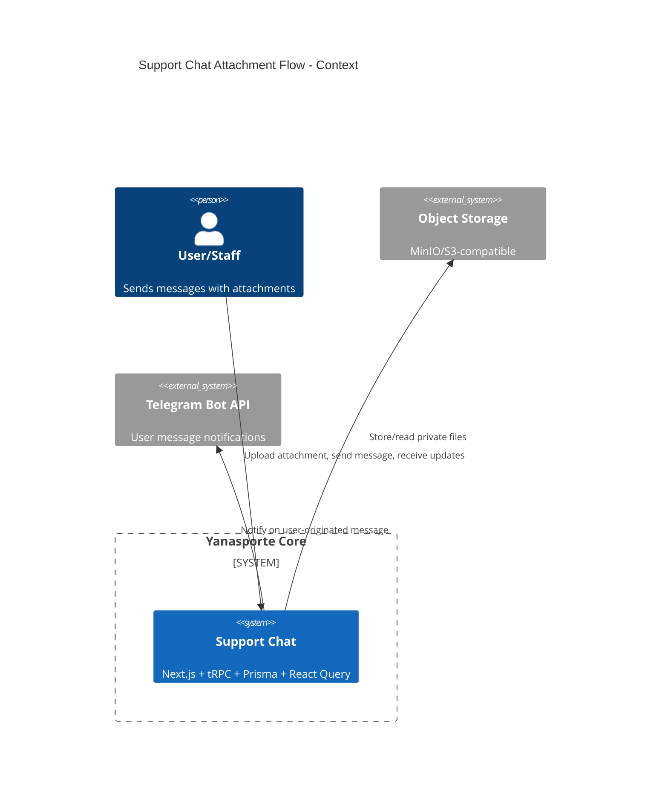
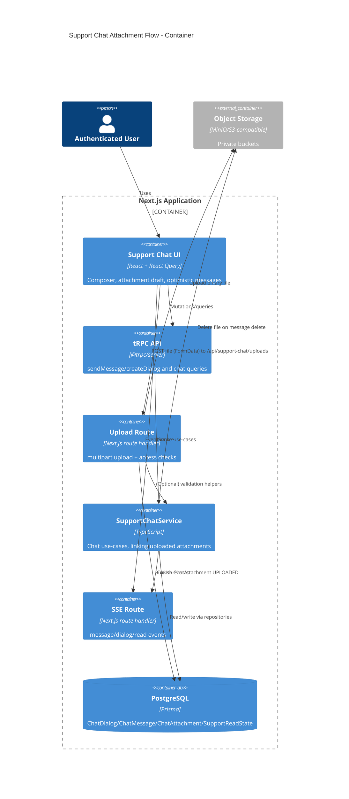
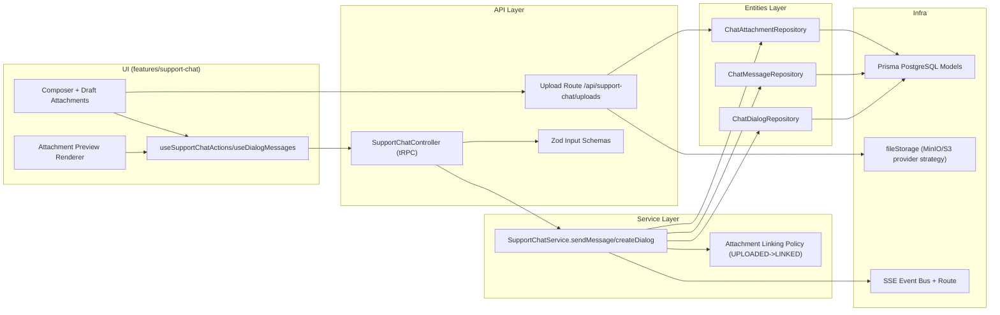
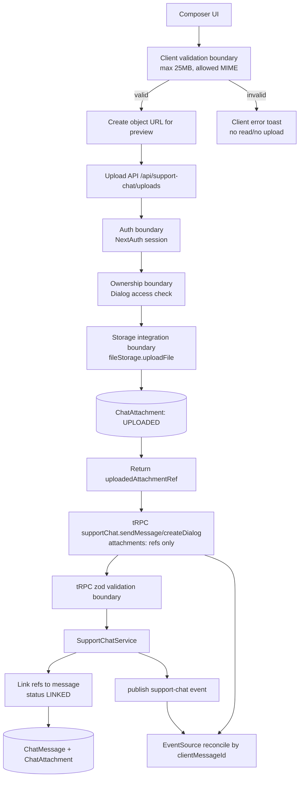
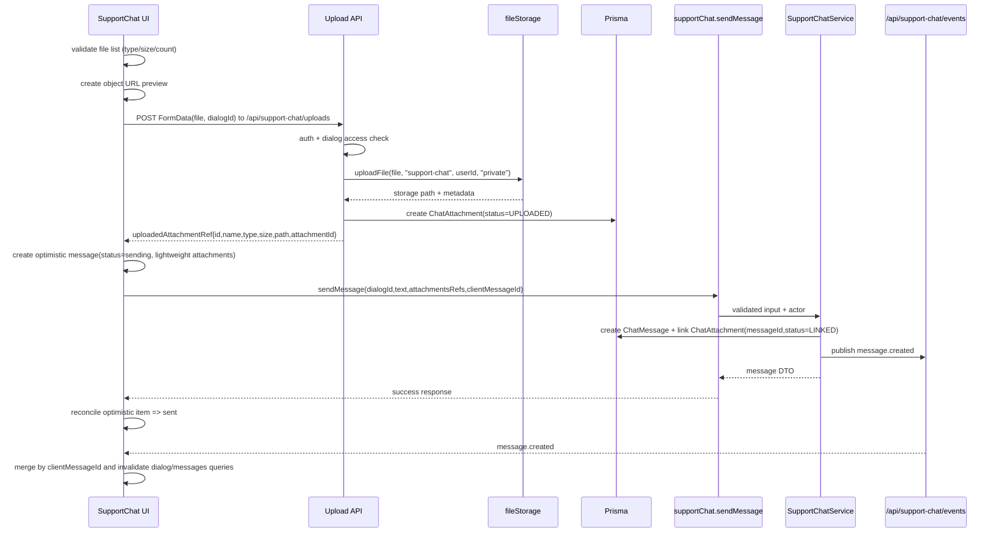

# Design: fix-upload-attach

## Summary
Дизайн переводит flow вложений support-chat с inline base64 payload на двухшаговую схему: отдельная загрузка `File` в namespace `/api/support-chat/uploads` с возвратом attachment token/metadata, затем `sendMessage/createDialog` передают только metadata references. В optimistic state сохраняются только легкие поля (`id/name/type/size/status/previewUrl`), для preview используются object URL, а для видео вводится internal feature constant `10MB`: `>10MB` рендерится file card без inline `<video>`, `<=10MB` рендерится video preview.

## Goals
- G1: Исключить падение вкладки при attach/send больших видео, убрав base64/Data URL из client message flow.
- G2: Валидировать тип/размер файла до чтения контента и до upload запроса.
- G3: Сохранить текущие chat-инварианты: optimistic sending states, retry с тем же `clientMessageId`, SSE reconciliation, read/unread, ACL.

## Non-goals
- NG1: Переписывать transport событий (SSE остается).
- NG2: Менять существующую модель прав (`USER/STAFF/ADMIN`, `canManageSupportChats`).
- NG3: Мигрировать на presigned URL direct-to-storage в этой задаче.

## Assumptions
- A1: Upload endpoint доступен только аутентифицированным пользователям с доступом к целевому dialog.
- A2: Текущий `ChatAttachment` lifecycle (`UPLOADED -> LINKED`) остается; cleanup выполняется серверным cron/job по TTL для unlinked attachments.
- A3: API attachment retrieval (`/api/support-chat/attachments/...`) остается обратносуместимым для уже сохраненных сообщений.

## Constraints recap
- FSD: `shared -> entities -> features -> app`.
- DI через Inversify модули (`src/app/server.ts`, feature/entity `module.ts`).
- API-контракты чата через tRPC v11; NextAuth для auth.
- React Query policy по `docs/caching-strategy.md`.
- Storage providers: MinIO в dev, S3-compatible provider в non-dev через текущую стратегию `createFileStorage()`.
- Coding rules: без negated-condition+else, без nested ternary (кроме разделенных JSX-выражений).

## C4 (Context level)


## C4 (Container level)


## C4 (Component level)


List components and responsibilities with intended file locations:
- UI (features layer)
- `src/features/support-chat/_ui/support-chat-conversation-card.tsx`
- `src/features/support-chat/_ui/support-chat-attachments-upload.ts`
- `src/features/support-chat/_ui/support-chat-message-attachments.tsx`
- `src/features/support-chat/_vm/use-support-chat.ts`
- Responsibility: pre-upload file validation, object URL lifecycle, staged upload calls, optimistic attachment DTO (`pending/sending/sent/failed`).
- API (tRPC routers/procedures)
- `src/features/support-chat/_controller.ts`
- `src/features/support-chat/_domain/schemas.ts`
- Responsibility: accept attachment references (no base64 payload), enforce auth/origin validation, map errors.
- Services (use-cases)
- `src/features/support-chat/_services/support-chat-service.ts`
- Responsibility: link pre-uploaded attachments to message, idempotent send by `clientMessageId`, event publishing.
- Repositories (entities)
- `src/entities/support-chat/_repositories/chat-attachment-repository.ts`
- `src/entities/support-chat/_repositories/chat-message-repository.ts`
- Responsibility: persist uploaded attachments and link to message in canonical dialog scope.
- Integrations (kernel/shared)
- `src/app/api/support-chat/uploads/route.ts` (new)
- `src/shared/lib/file-storage/file-storage.ts` providers reused
- Responsibility: binary upload to private storage and metadata persistence with existing provider abstraction.
- Background jobs (if any)
- Existing stale-upload cleanup/backfill jobs remain unchanged (out of scope of this feature design).

## Data Flow Diagram (to-be)


## Sequence Diagram (main scenario)


## Sequence Diagram (error paths)
```mermaid
sequenceDiagram
  participant UI as SupportChat UI
  participant UP as Upload API
  participant TRPC as tRPC
  participant SVC as SupportChatService
  participant STO as fileStorage

  rect rgb(245,245,245)
  note over UI,UI: Auth failure
  UI->>UP: upload request
  UP-->>UI: 401/403
  UI->>UI: mark attachment failed, show error, do not send message
  end

  rect rgb(245,245,245)
  note over UI,UI: Validation error
  UI->>UI: select file >25MB or disallowed MIME
  UI->>UI: reject before upload, show validation message
  end

  rect rgb(245,245,245)
  note over UI,STO: Storage/upload failure
  UI->>UP: upload request
  UP->>STO: uploadFile
  STO-->>UP: throw
  UP-->>UI: 5xx/4xx
  UI->>UI: attachment failed; retry upload allowed
  end

  rect rgb(245,245,245)
  note over UI,SVC: Message send failure
  UI->>TRPC: sendMessage(attachment refs)
  TRPC->>SVC: sendMessage
  SVC-->>TRPC: error
  TRPC-->>UI: TRPCError
  UI->>UI: message status=failed, retry reuses same clientMessageId
  end
```

## API contracts (tRPC)
For each procedure:
- Name: `trpc.supportChat.sendMessage`
- Type: mutation
- Auth: protected; role/ownership via existing `assertDialogAccess` and staff permission checks.
- Input schema (zod):
- `dialogId: string`
- `clientMessageId?: string`
- `text?: string`
- `attachments?: Array<{ attachmentId: string; name: string; mimeType: string; sizeBytes: number }>`
- Output DTO:
- `message: { id, dialogId, clientMessageId, senderType, text, attachments, createdAt }`
- `dialog: { dialogId, updatedAt }`
- `unread: { user, staff }`
- Errors: `UNAUTHORIZED`, `FORBIDDEN`, `BAD_REQUEST`, `NOT_FOUND`, `INTERNAL_SERVER_ERROR`.
- Cache: invalidate `supportChat.userListDialogs`, `supportChat.staffListDialogs`, `supportChat.getUnansweredDialogsCount`, `supportChat.userGetMessages({dialogId})`.

- Name: `trpc.supportChat.createDialog`
- Type: mutation
- Auth: protected; `USER` role only.
- Input schema (zod):
- `initialMessage: string`
- `topic?: string`
- `attachments?: Array<{ attachmentId: string; name: string; mimeType: string; sizeBytes: number }>`
- Output DTO: unchanged shape (`dialogId`, `createdAt`, `firstMessageId`).
- Errors: same mapping policy as sendMessage.
- Cache: invalidate user dialogs + unread counters + messages for created dialog.

- Name: `trpc.supportChat.userGetMessages` / `trpc.supportChat.staffListDialogs` / `trpc.supportChat.userListDialogs`
- Type: query
- Auth: unchanged.
- Input/output: unchanged; `attachments` remains stored attachment array payload on message DTO.
- Cache: keep existing query keys and `FREQUENT_UPDATE` strategy.

## Persistence (Prisma)
- Models to add/change:
- No required schema changes for MVP design; reuse `ChatAttachment` and `ChatMessage.attachments`.
- `ChatAttachment.status` lifecycle remains `UPLOADED -> LINKED`.
- Relations and constraints:
- Existing FK/unique/indexes remain (`ChatAttachment_messageId_idx`, `ChatAttachment_dialogId_id_idx`, `ChatMessage_dialogId_clientMessageId_key`).
- Indexes:
- Existing indexes are sufficient for lookup/link and message reconciliation.
- Migration strategy:
- No migration required for primary design path.
- Cleanup strategy for unlinked uploads:
- Use existing `ChatAttachment.status` + `createdAt` to select stale `UPLOADED` rows by TTL.
- Run cron/job that deletes storage object, then DB row (`ChatAttachment`) for stale unlinked uploads.

## Caching strategy (React Query)
- Query keys naming: reuse generated tRPC keys under `supportChat.*`.
- Invalidation matrix:
- `sendMessage` success -> invalidate `userGetMessages(dialogId)`, `userListDialogs`, `staffListDialogs`, `getUnansweredDialogsCount`.
- `createDialog` success -> invalidate `userListDialogs`, `getUnansweredDialogsCount`; prefetch/invalidate `userGetMessages(newDialogId)`.
- Upload mutation success/failure -> no global invalidation; local composer state update only.
- SSE `message.created/message.updated/read.updated/dialog.created` -> keep existing invalidation + clientMessageId reconciliation path.

## Error handling
- Domain errors vs TRPC errors:
- Reuse `SupportChatDomainError` and `mapSupportChatDomainErrorToTrpc` for send/create/link failures.
- Upload route errors map to HTTP (`401/403/404/413/415/429/500`) with user-facing message mapping in client layer.
- Mapping policy:
- Validation (size/type/count/empty message) -> `BAD_REQUEST` or client-side reject.
- Access violations -> `FORBIDDEN` / `NOT_FOUND` (for attachment retrieval/access patterns).
- Storage failures -> internal error with safe client message.

## Security
Threats + mitigations:
- AuthN (NextAuth session usage)
- Upload route and tRPC procedures require authenticated session (`getServerSession` / `authorizedProcedure`).
- AuthZ (role + ownership checks)
- Upload, send, read/download enforce dialog ownership (`USER`) and staff permission (`canManageSupportChats`) for non-user roles.
- IDOR prevention
- Upload and attachment-link operations require `dialogId` access check before DB/storage actions.
- Attachment download keeps existing per-dialog access gate before stream.
- Input validation
- Client pre-validation: max 25MB, MIME allow-list, max attachments/message.
- Server validation: repeat MIME/size/count checks regardless of client behavior.
- Storage security (signed URLs, private buckets, content-type/size limits)
- Files uploaded as `private` access level via existing provider abstraction.
- Client consumes attachments through API proxy route; raw storage path not exposed as public URL.
- Large-video preview guard reduces decoder/memory pressure (`size > 10MB` => file card only).
- Upload availability and resource protection
- Hard timeout на весь upload request.
- Abort при client disconnect.
- Abort при превышении лимита времени без прогресса.
- Корректная очистка временного объекта/незавершенного multipart upload в storage provider flow.
- CSRF / origin
- Keep existing trusted-origin checks for tRPC mutation paths.
- Upload route applies same trusted origin policy as mutation endpoints.
- Secrets handling
- Storage credentials remain only in server-side `privateConfig`.

## Observability
- Logging points (controller/service)
- Upload route: log upload fail/reject with `dialogId`, actor id, mime, size, error category.
- Service: log attachment-link mismatch/failure and message send failures with `clientMessageId`.
- Metrics/tracing
- Not in scope (no existing metrics pipeline in module); rely on logs and existing error monitoring.

## Rollout & backward compatibility
- Feature flags
- Reuse existing `ENABLE_SUPPORT_CHAT` only; отдельный compatibility flag для legacy payload не вводится.
- Migration rollout
- Step 1: deploy server support for new attachment ref payload + upload route.
- Step 2: deploy client upload flow and optimistic lightweight attachments.
- Step 3: remove legacy base64 path from client and server contract in the same release window.
- Rollback plan
- Rollback выполняется через deploy rollback на предыдущий релизный пакет (client + server), без runtime fallback на legacy payload.
- DB rollback не требуется (schema unchanged).

## Alternatives considered
- Alt 1: Keep tRPC JSON payload and remove base64 only from optimistic state.
- Rejected because large file conversion to base64 still happens before network request and keeps high memory pressure.
- Alt 2: Direct browser upload via presigned URL and only metadata through backend.
- Deferred: better scalability, but introduces additional signed URL contract and key management complexity beyond this fix scope.

## Open decisions
- D1 (resolved): upload endpoint размещается в отдельном namespace `/api/support-chat/uploads`.
- D2 (resolved): порог preview для видео фиксируется как internal feature constant `10MB`.
- D3 (resolved): legacy compatibility для base64 payload не сохраняется.

## Open questions
- Q1 (resolved): вводится hard timeout/abort policy (request timeout, abort on client disconnect, no-progress timeout, cleanup незавершенного upload).
- Q2 (resolved): вводится отдельный TTL cleanup trigger для unlinked `UPLOADED` attachments через cron/job.
- Q3 (resolved): поддержка legacy payload не сохраняется.
