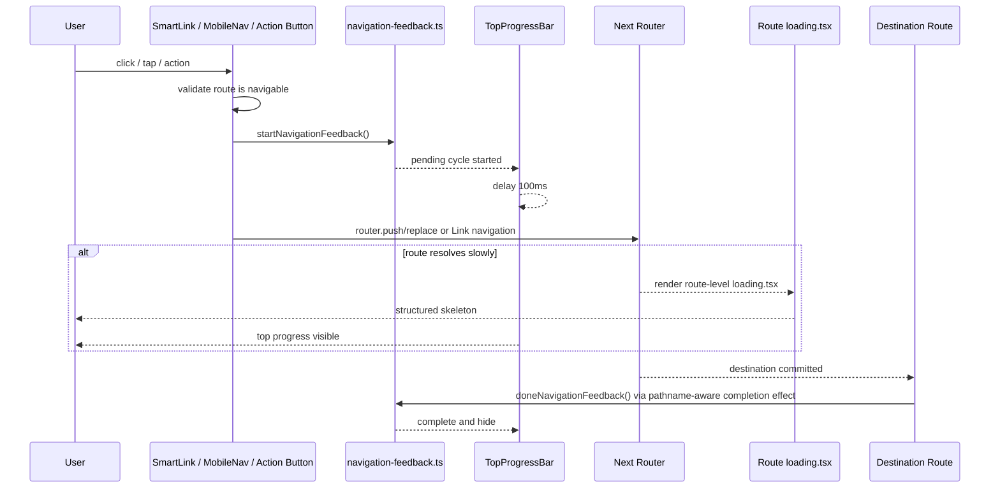
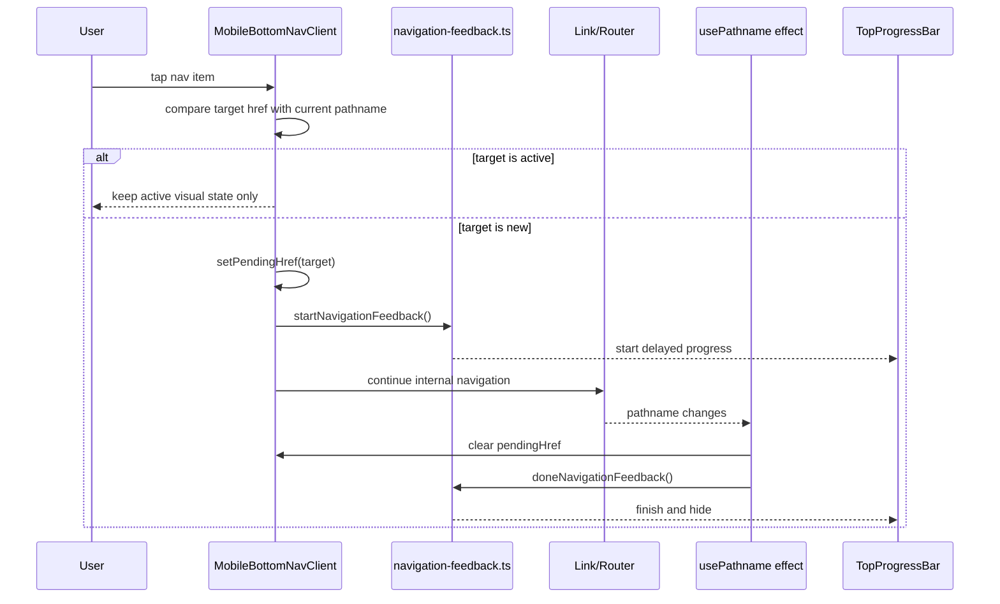
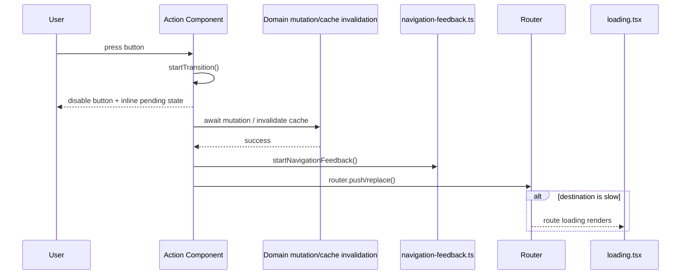

# Design: Navigation Pending UX

## Scope

Этот дизайн описывает первую итерацию единого pending UX только для private platform navigation.

В scope этой итерации входят:

- app-level infrastructure для global top progress bar
- private desktop navigation
- private mobile bottom navigation
- action-based navigation внутри private части приложения
- route-level skeleton screens для frequently used private routes

Вне scope этой итерации:

- public-site маршруты
- admin area
- массовая замена всех внутренних `Link`

Ограничение по текущему роутингу:

- В кодовой базе нет отдельного App Router path `platform/workouts`.
- Для этой итерации skeleton-покрытие проектируется только для существующих private routes:
  - `src/app/platform/(paid)/day/[courseSlug]/page.tsx`
  - `src/app/platform/(paid)/knowledge/page.tsx`
  - `src/app/platform/(paid)/practices/page.tsx`
  - `src/app/platform/(paid)/recipes/page.tsx`
  - `src/app/platform/(profile)/profile/page.tsx`

## Goals

- Дать пользователю немедленный feedback при внутренней навигации в private platform.
- Исключить повторный `router.push()` на уже активный route в private navigation.
- Добавить общий delayed top progress bar без layout shift.
- Сохранить локальный inline feedback в action-triggered navigation.
- Заменить blank/loading spinner на route-level skeleton там, где ожидание заметно.

## Non-goals

- Не вводить fullscreen loader как default паттерн.
- Не переводить всю кодовую базу на `SmartLink` в одном PR.
- Не менять серверные контракты, Prisma schema, storage integrations.

## Component Diagram

```mermaid
flowchart TD
  User[User]

  subgraph NextApp[Next.js App Router App]
    RootLayout[RootLayout<br/>src/app/layout.tsx]
    AppProvider[AppProvider<br/>src/app/_providers/app-provider.tsx]
    TopProgressBar[TopProgressBar<br/>src/shared/ui/top-progress-bar.tsx]
    NavFeedbackProvider[NavigationFeedbackProvider/Event Bridge<br/>src/shared/lib/navigation/navigation-feedback.ts]

    PrivateDesktop[MainNavClient private<br/>src/features/navigation/desktop/main-nav-client.tsx]
    PrivateMobile[MobileBottomNavClient private<br/>src/features/navigation/mobile/mobile-bottom-nav-client.tsx]
    SmartLink[SmartLink<br/>src/shared/ui/smart-link.tsx]
    ActionNavHelpers[startNavigationFeedback/doneNavigationFeedback]

    RouteLoadingPaid[(paid) loading.tsx]
    DayLoading[day/[courseSlug]/loading.tsx]
    KnowledgeLoading[knowledge/loading.tsx]
    PracticesLoading[practices/loading.tsx]
    RecipesLoading[recipes/loading.tsx]
    ProfileLoading[(profile)/profile/loading.tsx]
  end

  User --> PrivateDesktop
  User --> PrivateMobile
  User --> SmartLink
  User --> ActionNavHelpers

  RootLayout --> AppProvider
  AppProvider --> TopProgressBar
  AppProvider --> NavFeedbackProvider

  PrivateDesktop --> SmartLink
  PrivateMobile --> ActionNavHelpers
  SmartLink --> ActionNavHelpers

  ActionNavHelpers --> TopProgressBar
  RouteLoadingPaid --> User
  DayLoading --> User
  KnowledgeLoading --> User
  PracticesLoading --> User
  RecipesLoading --> User
  ProfileLoading --> User
```

## To-be Components

### 1. Navigation feedback module

Новый shared module: `src/shared/lib/navigation/navigation-feedback.ts`

Назначение:

- инкапсулировать старт и завершение глобального navigation feedback
- не требовать прямой работы с `window` в feature-коде
- служить общей точкой интеграции для `SmartLink`, mobile nav и action-based navigation

Публичный API:

- `startNavigationFeedback(): void`
- `doneNavigationFeedback(): void`
- `subscribeNavigationFeedback(listener): unsubscribe` или эквивалентный внутренний subscription API для UI-компонента progress bar

Поведение:

- `startNavigationFeedback()` создает новый pending cycle
- delayed display: bar не показывается до истечения порога `100ms`
- при длительном ожидании bar двигается псевдо-прогрессом до `90%`
- `doneNavigationFeedback()` завершает активный cycle, доводит bar до `100%` и скрывает его
- повторные `start` во время активного cycle не создают визуально конфликтующих дублей

### 2. TopProgressBar

Новый shared UI component: `src/shared/ui/top-progress-bar.tsx`

Назначение:

- слушать состояние navigation feedback module
- рисовать fixed top indicator поверх приложения

Поведение:

- монтируется один раз на app level
- не участвует в layout flow
- поддерживает light/dark theme
- скрыт при быстрых переходах короче `100ms`
- завершает анимацию после `doneNavigationFeedback()`

Подключение:

- `src/app/layout.tsx` или `src/app/_providers/app-provider.tsx`
- в этой итерации предпочтительно подключение в клиентском `AppProvider()`, чтобы progress bar имел доступ к client-side subscription lifecycle

### 3. SmartLink

Новый shared UI wrapper: `src/shared/ui/smart-link.tsx`

Назначение:

- сохранить API, близкий к `next/link`
- автоматически запускать navigation feedback для внутренних переходов
- не запускать feedback для внешних ссылок, якорей и already-active private nav targets, если вызывающая сторона передала соответствующую проверку

Поддерживаемое поведение первой итерации:

- для обычных внутренних переходов вызывает `startNavigationFeedback()` в `onClick`
- не вмешивается в стандартный prefetch/link behavior Next.js
- позволяет прокинуть пользовательский `onClick`

Первая итерация использования `SmartLink`:

- `src/features/navigation/desktop/main-nav-client.tsx`
- `src/features/headers/top-bar/_ui/logo.tsx` там, где переход относится к private flow
- `src/features/headers/top-bar/_ui/profile.tsx`
- `src/shared/ui/back-button.tsx` для сценариев с `href`
- ключевые private user entrypoints, где переход считается navigation-critical

### 4. Private mobile navigation item pattern

`src/features/navigation/mobile/mobile-bottom-nav-client.tsx` остается отдельной реализацией, а не становится thin wrapper над `SmartLink`.

Причина:

- mobile bottom nav требует раздельной логики active state и pending feedback
- нужно исключить старт feedback для already-active tab
- нужен мгновенный локальный tap response без inline spinner

To-be поведение:

- при тапе на активный item:
  - `event.preventDefault()`
  - `startNavigationFeedback()` не вызывается
  - локальный pending state не меняется
- при тапе на новый item:
  - выставляется локальный `pendingHref`
  - вызывается `startNavigationFeedback()`
  - выполняется стандартная link-navigation
- после изменения pathname:
  - `pendingHref` очищается
  - вызывается `doneNavigationFeedback()`

### 5. Action-based navigation pattern

Для private action buttons, которые инициируют route change после mutation или cache invalidation, вводится единый паттерн:

- локальный `useTransition()`
- immediate disabled state на trigger-кнопке
- inline spinner или pending label в зоне действия
- вызов `startNavigationFeedback()` непосредственно перед `router.push()` или `router.replace()`
- вызов `doneNavigationFeedback()` выполняется не в button-компоненте, а when navigation settles on destination route via pathname-aware completion logic

Первичные точки интеграции первой итерации:

- `src/features/daily-plan/_ui/course-activation-option.tsx`
- `src/features/user-courses/_ui/user-course-item.tsx`
- дополнительные private action entrypoints, где текущий UX зависит от `router.push()` / `router.replace()` и пользователь ожидает мгновенный feedback

### 6. Route-level skeletons

Новые/обновленные route loading files:

- `src/app/platform/(paid)/day/[courseSlug]/loading.tsx`
- `src/app/platform/(paid)/knowledge/loading.tsx`
- `src/app/platform/(paid)/practices/loading.tsx`
- `src/app/platform/(paid)/recipes/loading.tsx`
- `src/app/platform/(profile)/profile/loading.tsx`

Существующий `src/app/platform/(paid)/loading.tsx` сохраняется как segment fallback, но перестает быть единственным loading UX для private zone.

Требования к skeleton:

- повторяет общую композицию целевой страницы
- использует существующие shared primitives, например `Skeleton`
- не показывает blank screen
- не зависит от бизнес-данных

## To-be Data Flow



## Main Sequence: Private Mobile Bottom Nav



## Main Sequence: Action-based Navigation



## Integration Design

### App-level mounting

- `TopProgressBar` монтируется один раз внутри client tree.
- Предпочтительная точка подключения: `src/app/_providers/app-provider.tsx`.
- `AppProvider()` уже является общим client boundary и не требует дополнительных server-side data dependencies.

### Completion strategy

`doneNavigationFeedback()` должен вызываться централизованно по факту коммита навигации, а не в момент клика.

Первая итерация completion strategy:

- private desktop nav: completion effect внутри `MainNavClient()` по изменению `pathname`
- private mobile nav: completion effect внутри `MobileBottomNavClient()` по изменению `pathname`
- generic fallback для action-based navigation и `SmartLink`: отдельный lightweight client listener на `usePathname()` в app-level provider, который завершает активный feedback cycle при любом pathname change

Это позволяет:

- не размножать `doneNavigationFeedback()` по feature-кнопкам
- синхронизировать завершение progress bar с фактическим route commit

### SmartLink adoption map

В первой итерации `SmartLink` заменяет только navigation-critical entrypoints:

- private desktop navigation links
- private profile avatar link
- `BackButton` с `href`
- private logo/navigation entrypoints, где переход является internal
- отдельные private user-scenario links, если они являются ключевыми входами в route transitions

Остальные `Link` остаются без миграции.

## tRPC Contracts

Изменений в tRPC API в этой итерации не требуется.

- Новые procedures: нет
- Изменения input/output DTO: нет
- Изменения error contracts: нет

Причина:

- pending UX реализуется целиком на клиентском слое App Router navigation и route-level loading UI

## Prisma / Storage Changes

Изменений не требуется.

- Prisma schema: нет изменений
- migrations: нет
- indexes: нет
- S3/MinIO storage contracts: нет изменений

## Security

### Threats

- Повторный запуск навигации может привести к дублирующим переходам и повторным action triggers.
- Глобальный feedback state может остаться "зависшим", если completion logic не сработает.
- Обертка над `Link` может случайно затронуть внешние ссылки или некорректно обрабатывать modified click behavior.
- Action-based navigation может заблокировать кнопки дольше ожидаемого, если pending state связан не с route commit, а с локальным mutation state.

### Mitigations

- already-active route check сохраняется в private desktop/mobile navigation
- mobile bottom nav не запускает feedback для активной вкладки
- `SmartLink` ограничивается internal navigation logic и не меняет внешние ссылки
- completion logic централизуется через pathname-aware listener
- локальный disabled state и inline spinner остаются только в зоне действия конкретной кнопки
- глобальный top progress bar не блокирует взаимодействие с нижней навигацией и не захватывает pointer events

## Acceptance Mapping

- `progress bar не мигает на быстрых переходах`
  - обеспечивается delayed start `100ms`
- `работает и для ссылок, и для кнопок`
  - покрывается `SmartLink` + action-based helper pattern
- `кнопка сразу показывает pending state и блокируется`
  - покрывается `useTransition()` и inline pending state
- `skeleton появляется на data-heavy routes`
  - покрывается route-specific `loading.tsx`
- `нет blank state во время загрузки`
  - достигается комбинацией top progress + skeleton
- `без deprecated API`
  - используются `next/link`, `useRouter`, `usePathname`, `loading.tsx`

## Files Expected To Change In Implementation

- `src/app/_providers/app-provider.tsx`
- `src/app/layout.tsx` или без изменений, если bar монтируется внутри `AppProvider()`
- `src/shared/lib/navigation/navigation-feedback.ts`
- `src/shared/ui/top-progress-bar.tsx`
- `src/shared/ui/smart-link.tsx`
- `src/features/navigation/desktop/main-nav-client.tsx`
- `src/features/navigation/mobile/mobile-bottom-nav-client.tsx`
- `src/features/headers/top-bar/_ui/logo.tsx`
- `src/features/headers/top-bar/_ui/profile.tsx`
- `src/shared/ui/back-button.tsx`
- `src/features/daily-plan/_ui/course-activation-option.tsx`
- `src/features/user-courses/_ui/user-course-item.tsx`
- `src/app/platform/(paid)/day/[courseSlug]/loading.tsx`
- `src/app/platform/(paid)/knowledge/loading.tsx`
- `src/app/platform/(paid)/practices/loading.tsx`
- `src/app/platform/(paid)/recipes/loading.tsx`
- `src/app/platform/(profile)/profile/loading.tsx`
- возможно дополнительные private entrypoint files, если они будут подтверждены в plan phase как navigation-critical

## Open Questions For Plan Phase

- Какие именно private action-based entrypoints, кроме `CourseActivationOption` и `UserCourseItem`, включать в первую реализацию без расширения scope.
- Нужен ли отдельный app-level pathname listener для завершения feedback cycle, или достаточно completion effects в интегрированных компонентах первой итерации.
