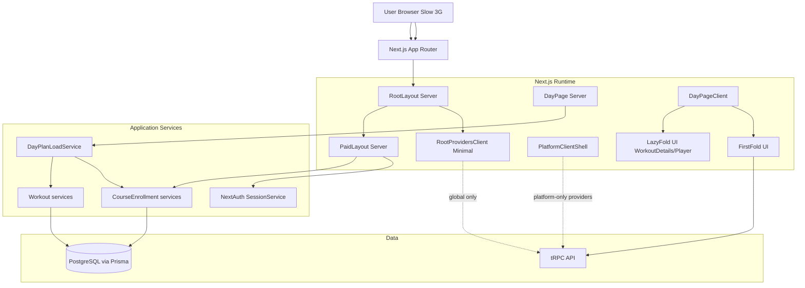
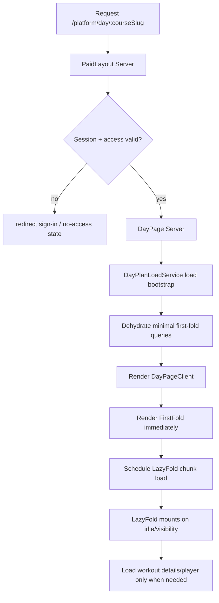
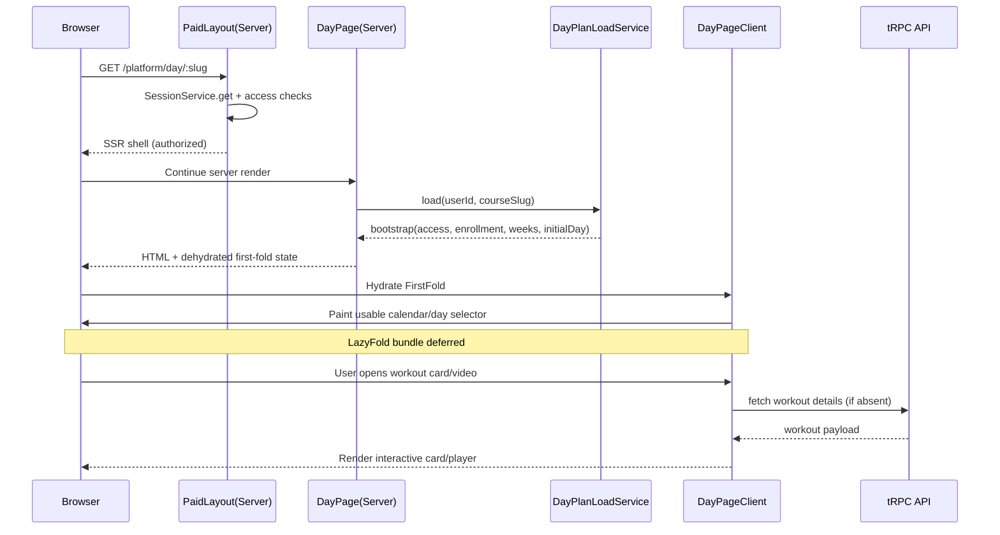

# Phase II — Design (to-be): perfomance-3g

## Goal and quality gate
- Goal: reduce critical-path JS and time-to-usable UI for `/platform/day/[courseSlug]` on slow 3G.
- Scope for first implementation wave: only changes that directly affect first route load and do not alter business behavior.
- Quality Gate #1: no implementation until this design is approved.

## Target outcomes (for Phase IV)
- Lower `First Load JS` for `/platform/day/[courseSlug]` versus current baseline (`257 kB` from 2026-03-12 build).
- Remove Prisma runtime payload from client chunks for day route.
- Shift non-critical client functionality out of root critical path.
- Keep SSR auth/access checks and paid-route behavior unchanged.

## C4 — Component level (to-be)

### Component responsibilities (to-be)
- `RootProvidersClient Minimal`: only universally required providers for all routes.
- `PlatformClientShell`: platform-scoped providers/effects moved from root (`TopProgressBar`, navigation feedback completion, `ActivityTracker`, `Toaster`, optionally part of session-dependent UI orchestration).
- `DayPageClient` split:
  - `FirstFold UI`: banner + day/week selector and minimal CTA states.
  - `LazyFold UI`: workout cards/player and non-critical interactions via dynamic import.
- Shared domain enums for client: client-safe enum module (no `@prisma/client` import in `use client` modules).

## To-be data flow

## Main scenario sequence (slow 3G)

## Proposed technical design

### D1. Route-scope provider composition
- Keep root provider chain minimal in `src/app/_providers/app-provider.tsx`.
- Introduce platform-scoped client shell mounted only in platform layouts (initially `src/app/platform/(paid)/layout.tsx`, optionally `(profile)` after validation).
- Move non-essential global side effects from root to platform shell:
  - `ActivityTracker`
  - `TopProgressBar`
  - navigation completion listener
  - `Toaster` (if accepted globally optional; otherwise keep global)

Expected effect:
- less JS in routes outside platform;
- reduced critical work before first usable content on day route by avoiding always-on root side effects.

### D2. Remove `@prisma/client` from client modules
- Replace direct Prisma enum imports in `use client` files with client-safe domain enums/constants.
- Candidate files in day-path:
  - `src/features/daily-plan/_ui/day-tabs.tsx`
  - `src/features/daily-plan/_ui/exercise-card.tsx`
  - `src/features/course-enrollment/_vm/use-course-enrollment.ts`
- Server files remain unchanged and continue using Prisma enums where needed.

Expected effect:
- remove Prisma runtime payload from day client chunk (`6164-*.js` observed in research).

### D3. First-fold vs lazy-fold split for day page
- Keep first fold SSR+hydrate focused on:
  - access state
  - banner
  - week/day selection
  - basic day availability
- Move heavy interactive blocks to deferred chunks:
  - workout card internals
  - video player (`@kinescope/react-kinescope-player`)
  - non-critical mutations and toast-driven UX
- Trigger lazy load on visibility or explicit user action.

Expected effect:
- earlier first usable paint on slow network;
- reduced initial bytes on first route load.

### D4. Avoid duplicate client access checks in critical path
- Preserve server guard as source of truth.
- In `DayPageClient`, call fallback access query only when server bootstrap/context is absent or stale.
- Keep redirect/setup behavior unchanged.

Edge-case invariants (must not regress):
- Expired access:
  - If access expires between SSR and hydration, client fallback must converge to `hasAccess=false` and show existing no-access state without exposing workout content.
- Race after course activation:
  - If activation completes while day route is hydrating, stale dehydrated state must be invalidated/refetched before access/setup decisions are finalized.
- Setup not completed:
  - `setupCompleted=false` must always keep redirect to `/platform/select-workout-days/:id` as highest-priority post-access action.
- Active enrollment switch:
  - If active enrollment changes (another tab/device or immediate user action), page must recompute `isActive`, `activeEnrollment`, and day context from fresh query data before rendering activation banners/day data.

Safety mechanics for D4:
- Use server-provided paid-access state as initial snapshot only; require query refresh when snapshot version key changes.
- Treat `setupCompleted` redirect condition as deterministic guard (no lazy deferral).
- Keep no-access rendering path idempotent for both SSR result and client refetch result.
- Ensure query invalidation on enrollment activation/update events includes:
  - `course.getAccessibleEnrollments`
  - `course.checkAccessByCourseSlug`
  - `course.getEnrollmentByCourseSlug`
  - `course.getActiveEnrollment`

Expected effect:
- fewer startup client requests/logic branches during hydration.

## tRPC contracts (to-be)

### Contract strategy
- Phase 1: no new public tRPC procedures required.
- Reuse existing procedures; adjust client call conditions and hydration usage.

### Procedures in use (unchanged schema)
1. `course.checkAccessByCourseSlug`
- Input DTO: `{ userId: string; courseSlug: string }`
- Output DTO:
  - `{ hasAccess: boolean; enrollment: Enrollment | null; activeEnrollment: Enrollment | null; isActive: boolean; accessExpiresAt: Date | string | null; setupCompleted: boolean }`
- Errors: auth failures from `authorizedProcedure`, domain errors when course/enrollment missing.

2. `course.getEnrollmentByCourseSlug`
- Input DTO: `{ userId: string; courseSlug: string }`
- Output DTO: `Enrollment | null`
- Errors: auth failures; service/repository failures.

3. `course.getAvailableWeeks`
- Input DTO: `{ userId: string; courseSlug: string }`
- Output DTO:
  - `{ availableWeeks: number[]; totalWeeks: number; currentWeekIndex: number; weeksMeta?: { weekNumber: number; releaseAt: string }[]; maxDayNumber?: number; totalDays?: number }`
- Errors: auth failures; `Enrollment not found`; `Course not found`.

4. `workout.getUserDailyPlan`
- Input DTO: `{ userId: string; enrollmentId: string; courseId: string; dayNumberInCourse: number }`
- Output DTO: `UserDailyPlan | null`
- Errors: auth failures; access validation failures in service path.

5. `workout.getWorkout`
- Input DTO: `{ workoutId: string }`
- Output DTO: `Workout | null`
- Errors: auth failures; repository failures.

## Prisma / storage changes
- Phase 1: no Prisma schema changes.
- No migrations.
- No new indexes/tables.

## Security review (threats and mitigations)
1. Threat: unauthorized access through client-only checks bypass.
- Mitigation:
  - keep server-side checks in paid layout and day page (`SessionService`, access services, guard layout);
  - treat client checks as UX fallback only.

2. Threat: userId spoofing in client-provided procedure input.
- Mitigation:
  - continue relying on `authorizedProcedure` server session;
  - in future hardening, prefer deriving `userId` from `ctx.session.user.id` instead of trusting input (out of phase-1 scope).

3. Threat: exposing server/runtime-only libraries in browser bundle.
- Mitigation:
  - remove `@prisma/client` imports from all `use client` modules;
  - add lint guard to block this import in client components.

4. Threat: degraded navigation/feedback UX after provider relocation.
- Mitigation:
  - keep behavior parity tests for pending navigation, progress bar visibility, and activity tracking events on platform routes.

5. Threat: XSS/injection via deferred UI state.
- Mitigation:
  - no new HTML injection paths;
  - keep existing React escaping and typed DTOs.

## Verification plan (for implementation phase)
- Build metrics:
  - `npm run build` compare `First Load JS` for `/platform/day/[courseSlug]` before/after.
  - verify day route chunk list no longer contains Prisma runtime payload chunk.
- Runtime checks:
  - manual slow-3G profile on `/platform/day/[courseSlug]` for first usable paint timing.
  - confirm auth redirect and no-access/setup redirects unchanged.
  - edge case: expired access during hydration -> no-access state rendered, no workout details leak.
  - edge case: race right after activation -> access/enrollment state converges after invalidation/refetch.
  - edge case: `setupCompleted=false` -> deterministic redirect to setup route.
  - edge case: active enrollment switched -> UI rebases to new active enrollment without stale banner/day mismatch.
- Regression checks:
  - `npm run lint`
  - `npm run lint:types`
  - focused manual flow: calendar/day switch, workout open, video play, completion/favorite mutation.

## Out of scope for phase 1
- DB schema changes or caching-policy overhaul.
- Full navigation system redesign.
- Refactor of admin/public route bundles unrelated to platform day route.
