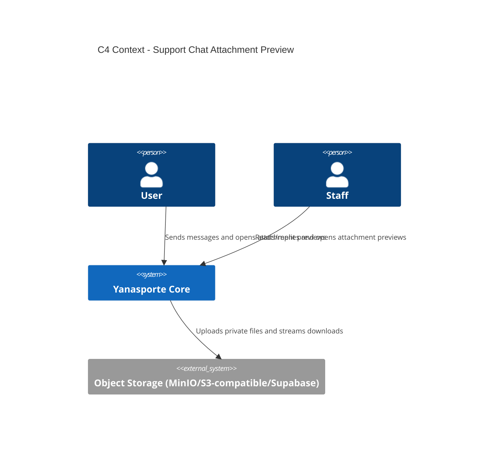
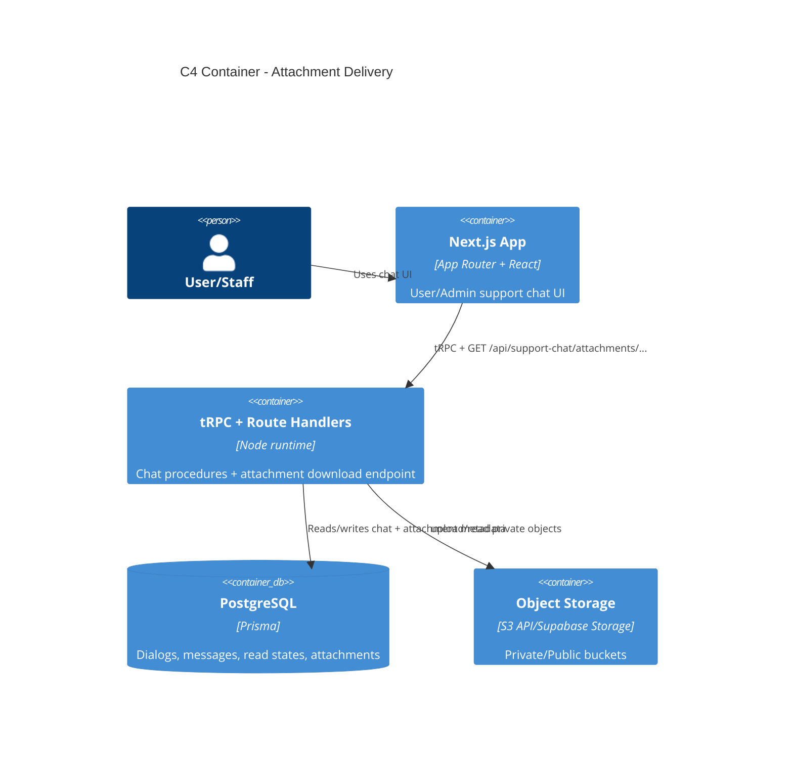
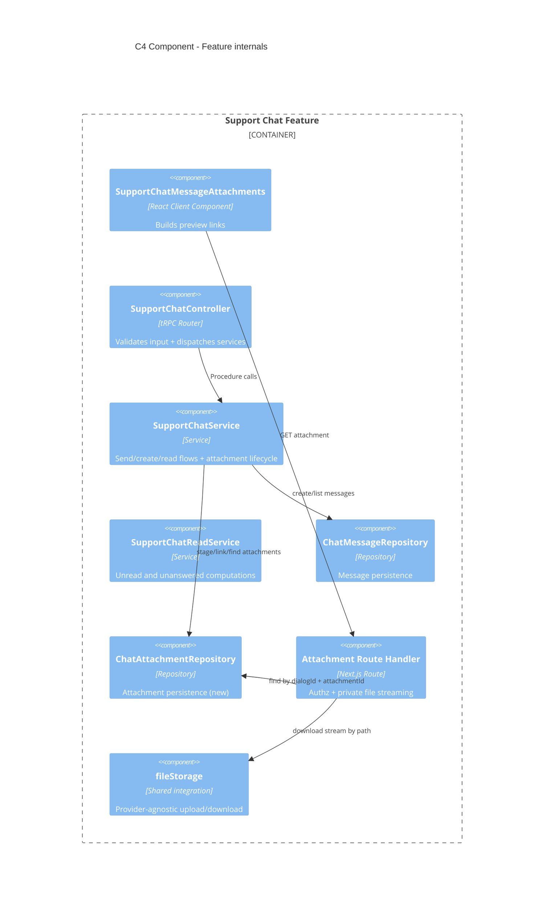
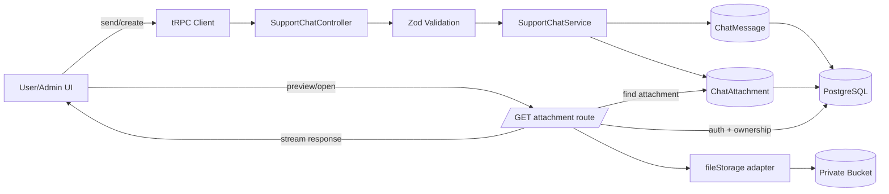
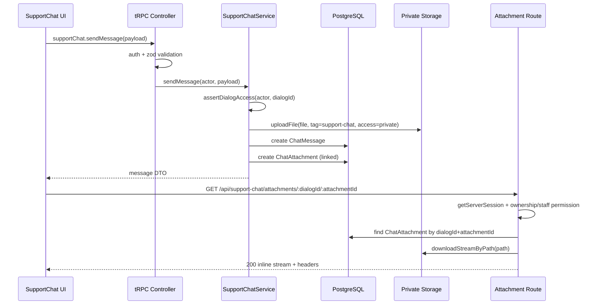
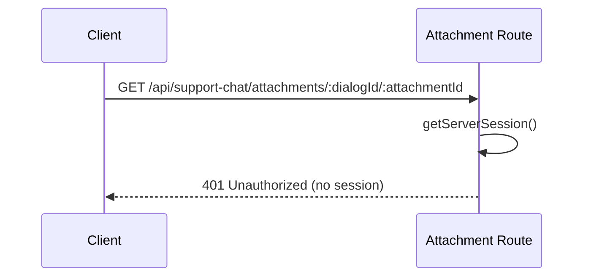
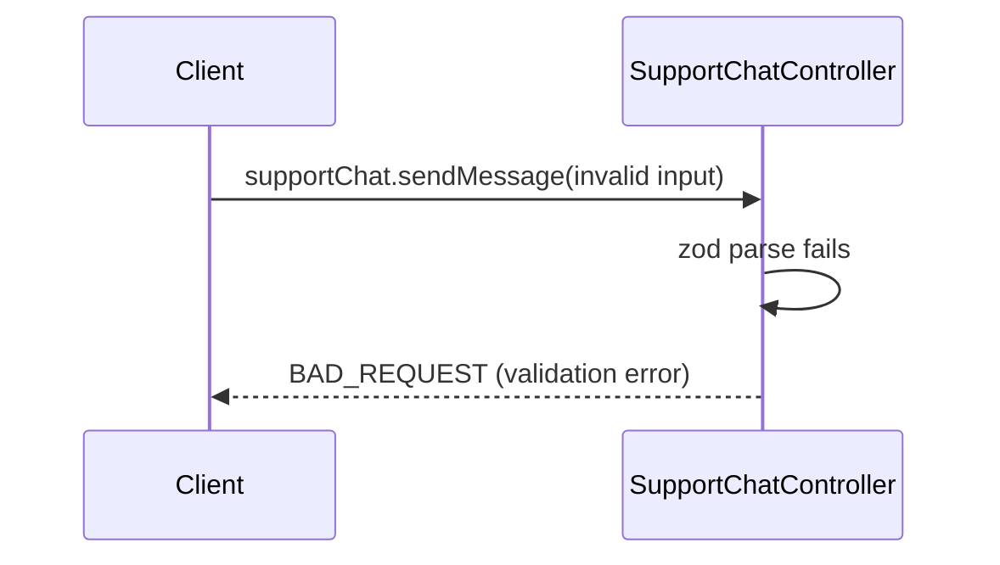
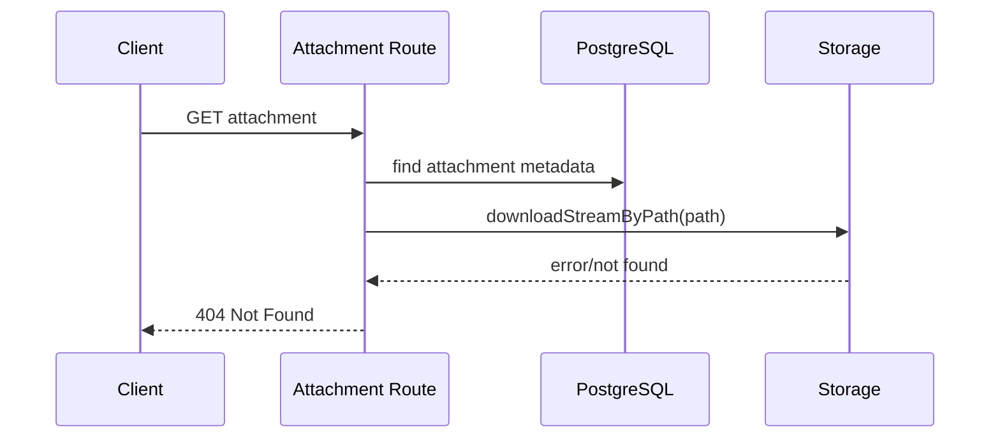

# Design: preview-img-support-chat

## Summary
Дизайн переводит поток вложений support-chat с JSON-scan в `ChatMessage.attachments` на отдельную attachment-модель (`ChatAttachment`) с O(1)-lookup, сохраняет единый приватный download endpoint `/api/support-chat/attachments/...`, добавляет stream-first выдачу, conditional caching (`ETag`/`Last-Modified`), базовый rate limiting для endpoint и staged lifecycle (`UPLOADED -> LINKED`) для снижения риска orphan-файлов. UI user/admin продолжает использовать текущий URL endpoint, без прямого доступа к private bucket.

## Goals
- G1: Убрать поиск вложений по всем сообщениям диалога и перейти на прямой lookup attachment по `attachmentId + dialogId`.
- G2: Снизить нагрузку на память/CPU на выдаче вложений за счет stream-first ответа из storage.
- G3: Сохранить provider-agnostic модель хранения (MinIO/S3-compatible/Supabase) с private/public bucket и единым authz boundary на backend.

## Non-goals
- NG1: Полная реализация byte-range (`206`) для видео/PDF в этой итерации.
- NG2: Полный rework всех существующих site/public media flows за пределами support-chat.

## Constraints recap
- FSD layering: `shared -> entities -> features -> app`.
- tRPC v11 и NextAuth остаются основным API/auth стеком.
- DI registration через Inversify `module.ts` и `createServer()`.
- Caching policy aligned с `docs/caching-strategy.md`.
- Storage split: public/private buckets; support-chat attachments читаются только через backend route.

## Assumptions
- A1: Фоновый cron/worker контур для cleanup может быть подключен в существующей инфраструктуре запуска скриптов.
- A2: Private storage provider в production поддерживает stream read и/или выдачу метаданных для `ETag`/`Last-Modified`.

## C4 (Component level)
List components and responsibilities with intended file locations:
- UI (features layer)
  - `src/features/support-chat/_ui/support-chat-message-attachments.tsx`
  - `src/features/support-chat/user-chat/_ui/support-chat-user-page.tsx`
  - `src/features/support-chat/admin-chat/_ui/support-chat-admin-inbox-page.tsx`
  - Responsibility: отображение preview/open ссылок и вызов private attachment endpoint.
- API (tRPC routers/procedures)
  - `src/features/support-chat/_controller.ts`
  - `src/features/support-chat/_domain/schemas.ts`
  - Responsibility: процедуры `sendMessage/createDialog/userGetMessages/...` с attachment metadata в DTO.
- Services (use-cases)
  - `src/features/support-chat/_services/support-chat-service.ts`
  - `src/features/support-chat/_services/support-chat-read-service.ts`
  - Responsibility: валидация payload, upload/stage/link attachment, authz checks, unread/read logic.
- Repositories (entities)
  - Existing: `SupportConversationRepository`, `ChatMessageRepository`, `SupportReadStateRepository`
  - New: `ChatAttachmentRepository` (новый файл в `src/entities/support-chat/_repositories/`)
  - Responsibility: Prisma persistence для dialogs/messages/read-state/attachments.
- Integrations (kernel/shared)
  - `src/shared/lib/file-storage/_providers/*`
  - `src/shared/lib/file-storage/types.ts`
  - `src/app/api/support-chat/attachments/[dialogId]/[attachmentId]/route.ts`
  - Responsibility: private/public upload/read abstraction, stream response, HTTP headers.
- Background jobs (if any)
  - Planned cleanup job in `scripts/` or feature-level scheduler integration.
  - Responsibility: удаление orphan staged attachments и stale storage keys.

## Data Flow Diagram (to-be)
- UI -> tRPC client -> Router -> Procedure -> Service -> Repository -> Prisma -> External integrations.
- Validation boundary: zod schemas in controller input.
- Auth boundary: NextAuth session + protected procedures/route session checks.
- Ownership boundary: `dialog.userId == session.user.id` or staff permission.
- Integration boundary: storage read/write via `fileStorage` abstraction.

## Sequence Diagram (main scenario)
1. User sends message with attachment.
2. `sendMessage` mutation enters protected tRPC procedure.
3. Input schema validates `dialogId/text/attachments`.
4. Service checks dialog access by role/ownership.
5. Service uploads binary to private bucket with key `support-chat/<userId>/...`.
6. Service writes message and attachment metadata in DB (`ChatMessage` + `ChatAttachment`).
7. Service emits `message.created` event.
8. Client receives invalidation/refetch and renders message.
9. User/admin opens preview URL `/api/support-chat/attachments/:dialogId/:attachmentId`.
10. Route validates session/access, fetches attachment metadata by `(dialogId, attachmentId)`, reads storage stream, returns inline response.

## Sequence diagrams (error paths)

### Auth failure

### Validation error (tRPC mutation)

### Storage failure on download

## API contracts (tRPC)
For each procedure:
- Name: `trpc.supportChat.createDialog`
- Type: mutation
- Auth: protected; `USER` only for creating dialog
- Input schema (zod): `topic?`, `initialMessage`, `attachments[]?`
- Output DTO: `dialogId`, `createdAt`, `firstMessageId`
- Errors: `UNAUTHORIZED`, `FORBIDDEN`, `BAD_REQUEST`, `INTERNAL_SERVER_ERROR`
- Cache: invalidate `supportChat.userListDialogs`, `supportChat.userGetMessages(dialogId)` after success

- Name: `trpc.supportChat.sendMessage`
- Type: mutation
- Auth: protected; role + ownership rules (`USER` own dialog, `STAFF` permission, `ADMIN`)
- Input schema (zod): `dialogId`, `text?`, `attachments[]?`
- Output DTO: `{ message, dialog, unread }`
- Errors: `UNAUTHORIZED`, `FORBIDDEN`, `BAD_REQUEST`, `NOT_FOUND`, `INTERNAL_SERVER_ERROR`
- Cache: invalidate dialogs + message thread by `dialogId`

- Name: `trpc.supportChat.userGetMessages`
- Type: query
- Auth: protected; role + ownership rules
- Input schema (zod): `dialogId`, `cursor?`, `limit`
- Output DTO: paginated message list including attachment metadata summary (`id/name/type/size/path` or mapped access DTO)
- Errors: `UNAUTHORIZED`, `FORBIDDEN`, `NOT_FOUND`
- Cache: `FREQUENT_UPDATE`, invalidated by `message.created/read.updated`

- Name: `trpc.supportChat.userListDialogs`
- Type: query
- Auth: protected; `USER`
- Input schema (zod): `cursor?`, `limit`
- Output DTO: paginated dialogs with unread counters
- Errors: `UNAUTHORIZED`, `FORBIDDEN`
- Cache: `FREQUENT_UPDATE`

- Name: `trpc.supportChat.staffListDialogs`
- Type: query
- Auth: protected; `ADMIN` or `STAFF + canManageSupportChats`
- Input schema (zod): `cursor?`, `limit`, `hasUnansweredIncoming?`
- Output DTO: paginated dialogs with user info and `hasUnansweredIncoming`
- Errors: `UNAUTHORIZED`, `FORBIDDEN`
- Cache: `FREQUENT_UPDATE`

- Name: `trpc.supportChat.markDialogRead`
- Type: mutation
- Auth: protected; role + ownership rules
- Input schema (zod): `dialogId`, `lastReadMessageId`
- Output DTO: `dialogId`, `readerType`, `readAt`, `unreadCount`
- Errors: `UNAUTHORIZED`, `FORBIDDEN`, `NOT_FOUND`
- Cache: invalidate list + thread for `dialogId`

### Non-tRPC endpoint in scope
- Name: `GET /api/support-chat/attachments/:dialogId/:attachmentId`
- Auth: server session required
- Ownership/authz: same role rules as message read
- Output: binary stream (`inline`) with `Content-Type`, `Content-Disposition`, `Cache-Control: private`, `X-Content-Type-Options`, optional `ETag/Last-Modified`
- Errors: `401` (no session), `404` (no access/not found/storage miss), `429` (rate limit, to be added)

## Persistence (Prisma)
- Models to add/change
  - Add `ChatAttachment` model:
    - `id String @id`
    - `dialogId String`
    - `messageId String?`
    - `storagePath String`
    - `mimeType String`
    - `sizeBytes Int`
    - `originalName String`
    - `createdByUserId String`
    - `status ChatAttachmentStatus` (`UPLOADED`, `LINKED`)
    - `createdAt DateTime @default(now())`
    - `updatedAt DateTime @updatedAt`
  - Add enum `ChatAttachmentStatus`.
  - Keep `ChatMessage.attachments Json?` as transitional compatibility field during rollout.
- Relations and constraints
  - FK `dialogId -> ChatDialog.id` (cascade delete)
  - FK `messageId -> ChatMessage.id` (set null or cascade by lifecycle choice)
  - FK `createdByUserId -> User.id`
- Indexes
  - `@@index([dialogId, id])`
  - `@@index([messageId])`
  - `@@index([status, createdAt])` for cleanup job
- Migration strategy
  - Additive migration first.
  - Backfill optional (if needed for historical attachments) from `ChatMessage.attachments` JSON.
  - Read path switched to `ChatAttachment` lookup before legacy JSON cleanup.

## Caching strategy (React Query)
- Query keys naming
  - `supportChat.userListDialogs({limit,cursor})`
  - `supportChat.staffListDialogs({limit,cursor,hasUnansweredIncoming})`
  - `supportChat.userGetMessages({dialogId,limit,cursor})`
- Invalidation matrix
  - `createDialog` -> invalidate `userListDialogs`, `userGetMessages(dialogId)`
  - `sendMessage` -> invalidate `userListDialogs`, `staffListDialogs`, `userGetMessages(dialogId)`
  - `markDialogRead` -> invalidate `userListDialogs`, `staffListDialogs`, `userGetMessages(dialogId)`
  - SSE `dialog.created/message.created/read.updated` -> same query invalidations as current feature hooks
- Endpoint caching
  - Attachment route: `Cache-Control: private, max-age=300`
  - Add conditional caching (`ETag`/`Last-Modified`) for 304 support

## Error handling
- Domain errors vs TRPC errors
  - Keep `SupportChatDomainError` for service layer and map in controller via `mapSupportChatDomainErrorToTrpc`.
  - Attachment route remains HTTP error surface (`401/404/429/500` as applicable).
- Mapping policy
  - `DIALOG_NOT_FOUND`/`MESSAGE_NOT_FOUND` -> `NOT_FOUND`
  - `DIALOG_ACCESS_DENIED`/`STAFF_PERMISSION_DENIED` -> `FORBIDDEN`
  - `INVALID_MESSAGE` -> `BAD_REQUEST`
  - Unknown -> `INTERNAL_SERVER_ERROR`

## Security
Threats + mitigations:
- AuthN (NextAuth session usage)
  - Use server session checks in tRPC context and attachment route before any read.
- AuthZ (role + ownership checks)
  - Enforce ownership for `USER` by `dialog.userId` and staff permission by `canManageSupportChats`.
- IDOR prevention
  - Attachment lookup by `(dialogId, attachmentId)` in DB + `404` cloaking for no-access/not-found in route.
- Input validation
  - Keep zod validation for attachment metadata (`name/mime/size/base64`) and server-side MIME allowlist.
- Storage security (signed URLs, private buckets, content-type/size limits)
  - Store support-chat files in `private` bucket via `fileStorage.uploadFile(..., 'private')`.
  - Continue server-mediated read through `/api/support-chat/attachments/...`.
  - Stream response; keep content headers explicit (`Content-Type`, `nosniff`, `Content-Disposition`).
- Secrets handling
  - Storage credentials and external tokens remain server-only in `privateConfig`.

## Observability
- Logging points (controller/service)
  - Existing warning/error logging in Telegram and SSE paths remains.
  - Add route-level logs for attachment download failures/rate-limit events with technical identifiers (`dialogId`, `attachmentId`, status), excluding binary content.
- Metrics/tracing
  - Add counters/timers for attachment endpoint: request count, bytes served, latency, 4xx/5xx.

## Rollout & backward compatibility
- Feature flags (if needed)
  - Reuse existing support-chat enable flag (`ENABLE_SUPPORT_CHAT`) for controlled rollout; no separate user-facing flag required for preview route.
- Migration rollout
  1. Add `ChatAttachment` schema and repository.
  2. Dual-write attachment metadata (legacy JSON + new table).
  3. Switch read path (route) to new table.
  4. Add rate limit + conditional caching headers.
  5. Optional backfill for historical messages.
  6. Remove legacy JSON dependency in a later migration.
- Rollback plan
  - If read-path issues occur, revert route read to legacy JSON attachments while keeping additive schema intact.
  - If dual-write fails, keep message send path operational with legacy JSON and disable new table writes by feature toggle at service level.

## Alternatives considered
- Alt 1: Continue reading attachments only from `ChatMessage.attachments` JSON.
  - Rejected for target design due to linear lookup and no dedicated lifecycle state.
- Alt 2: Direct signed URL response from route for all requests.
  - Deferred: keeps provider coupling higher; stream-first route keeps single authz boundary and current UI contract.

## Open questions
- Q1: Should staged attachment cleanup run as cron script (`scripts/*`) or as application worker process in current deployment topology?
- answer Q1:  staged attachment cleanup run as cron script (`scripts/*`)? distributed lock
- Q2: For production storage provider, should conditional caching source (`ETag`/`Last-Modified`) come from DB metadata or provider object metadata when both are available?
- answer Q2: Make objects immutable; store ETag and Last-Modified in the database as a snapshot and use them for response headers. The storage provider is the source of truth, but there is no need to query it on every download.