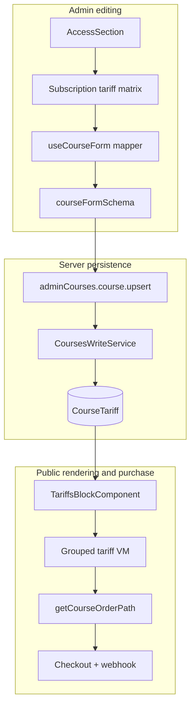
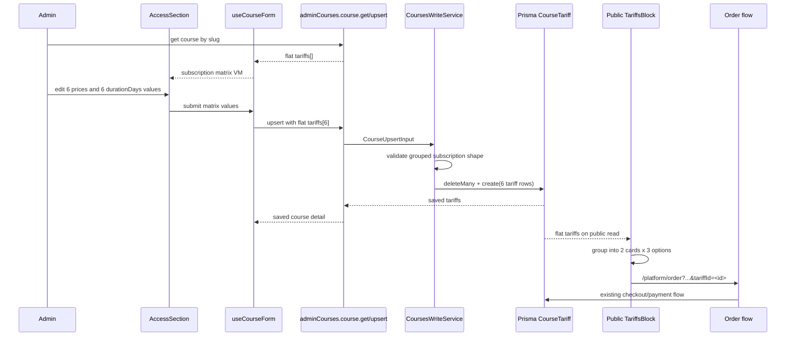
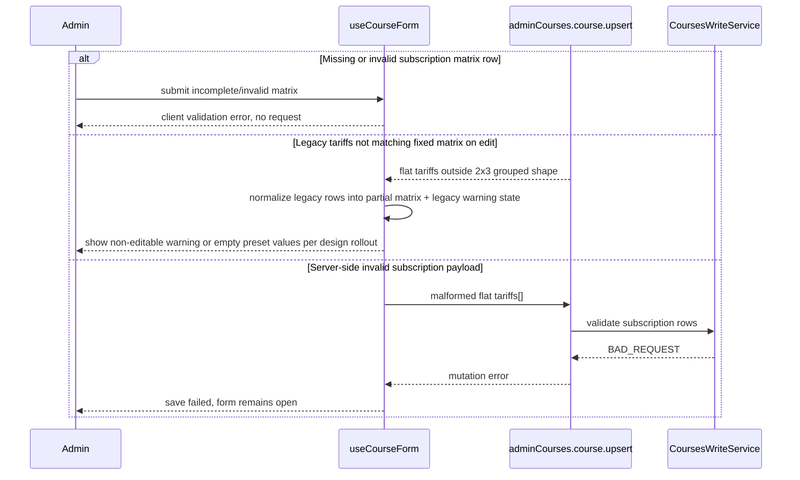

# Design: subscription-tariff-cards

## Summary
Для курсов типа `SUBSCRIPTION` админский UX будет ограничен двумя тарифными группами: `Без обратной связи` и `С обратной связью`. Внутри каждой группы админ будет работать с тремя слотами purchase-option, но длительность каждого слота по-прежнему задается в днях через `durationDays`, а не вычисляется из жестко зашитого списка месяцев. При сохранении курса эти данные по-прежнему будут записываться в существующую плоскую модель `CourseTariff[]` как шесть отдельных строк с комбинациями `feedback + durationDays`. На публичной странице курса эти шесть строк будут агрегироваться в две карточки, каждая карточка будет содержать три варианта покупки, ведущих в существующий checkout через конкретный `tariffId`. Если `durationDays` кратен 30, UI может показывать месячную подпись; иначе пользователь увидит длительность в днях.

## Goals
- G1: Для `SUBSCRIPTION` заменить свободное редактирование произвольного массива тарифов на жесткую матрицу `2 группы × 3 периода`.
- G2: Оставить текущую модель хранения `CourseTariff` и текущий checkout по `tariffId` без новых таблиц и без изменения webhook-потока.
- G3: Показать на публичной странице подписочного курса ровно две карточки тарифов, а внутри каждой карточки отрисовать три варианта покупки с длительностью, вычисляемой из `durationDays`.
- G4: Не менять поведение fixed-курсов в этой фазе.

## Non-goals
- NG1: Не вводить в этой фазе серверную скидочную модель для клиентов, которые уже покупали fixed-курс.
- NG2: Не менять Prisma-модель `CourseTariff` и не добавлять новые pricing tables.
- NG3: Не перерабатывать платежный пайплайн, кроме использования уже существующего `tariffId`.
- NG4: Не менять правила выдачи доступа, кроме использования выбранного тарифа как и сейчас.

## Assumptions
Только то, что не доказано research-фазой.
- A1: Для подписки остаются ровно две тарифные группы по `feedback`, но внутри каждой группы есть ровно три purchase-slot.
- A2: Длительность каждого subscription-slot продолжает задаваться явно в `durationDays`; одинаковые значения между слотами считаются пользовательской ошибкой и должны валидироваться.
- A3: Для fixed-курсов остается существующий редактор произвольных тарифов, либо его эквивалентное текущее поведение.
- A4: Если в старых subscription-курсах количество тарифов или комбинации `feedback + durationDays` не совпадают с моделью `2 группы × 3 слота`, они будут считаться legacy-данными и потребуют read-path нормализации.

## C4 (Component level)
- UI (admin): `src/features/admin-panel/courses/_ui/form-parts/access-section.tsx` будет ветвиться по `contentType`. Для `SUBSCRIPTION` вместо `useFieldArray`-списка будет отображаться матрица из двух карточек и трех slot-строк внутри каждой карточки.
- UI (admin form model): `src/features/admin-panel/courses/_ui/model/use-course-form.tsx` будет преобразовывать плоские `courseData.tariffs` в subscription view-model для формы и обратно в плоский `CourseUpsertInput['tariffs']` перед сохранением, сохраняя явный `durationDays` у каждого slot.
- UI validation: `src/features/admin-panel/courses/_ui/model/schema.ts` будет валидировать subscription-форму как полный набор required-цен и required `durationDays` для матрицы `feedback x slotIndex`, а fixed-курс оставит текущий валидатор массива тарифов.
- API schema: `src/features/admin-panel/courses/_schemas.ts` и `src/features/admin-panel/courses/_controller.ts` сохранят существующий внешний server contract `tariffs: CourseTariff[]`; сервер не получает новую вложенную структуру.
- Services: `src/features/admin-panel/courses/_services/courses-write.ts` продолжит принимать и сохранять плоский список тарифов, но получит дополнительную валидацию subscription-тарифов на стороне сервиса: ровно шесть комбинаций, по три строки на каждую группу `feedback`, с положительным `durationDays` и без дубликатов внутри группы.
- Read services: `src/features/admin-panel/courses/_services/courses-read.ts` останется источником плоского массива тарифов для edit-prefill.
- Public page UI: `src/app/(site)/courses/_ui/blocks/tariffs-block.tsx` будет строить subscription view-model из `course.tariffs`, группируя тарифы в две карточки по `feedback` и сортируя до трех option-кнопок по `durationDays`.
- Router / checkout: `src/kernel/lib/router.ts`, `src/features/course-order/_controller.ts`, `src/features/course-order/_services/start-course-order.ts`, `src/features/course-order/_services/receive-order-webhook.ts` остаются на существующей схеме выбора конкретного `tariffId`.

```mermaid
flowchart LR
  Admin[Admin]
  Form[Course form]
  Matrix[Subscription tariff matrix UI]
  Mapper[Form mapper]
  Trpc[tRPC adminCourses.course.upsert]
  Service[CoursesWriteService]
  Prisma[(CourseTariff rows)]
  Public[Course public page]
  VM[Subscription tariff view-model]
  Checkout[StartCourseOrderService]

  Admin --> Form --> Matrix
  Matrix --> Mapper
  Mapper --> Trpc --> Service --> Prisma
  Prisma --> Public --> VM --> Checkout
```

## Data Flow Diagram (to-be)
- Admin opens subscription course editor.
- Read path returns flat `course.tariffs[]` from Prisma.
- Client mapper normalizes flat tariffs into a fixed matrix keyed by `feedback` and `slotIndex`, preserving `durationDays` per slot.
- Admin edits six цен и шесть значений длительности в днях в matrix UI.
- Client submit mapper expands the matrix back into flat `tariffs[]` with six rows.
- tRPC upsert contract remains unchanged and sends plain `CourseTariff[]`.
- `CoursesWriteService` validates the subscription flat rows against the allowed grouped shape and persists them with the current `deleteMany/create` strategy.
- Public course page loads flat `course.tariffs[]`.
- `TariffsBlockComponent` groups rows into two cards and builds up to three buy actions per card, labeling each action from `durationDays`.
- Click on a duration button goes to the existing order URL with the concrete `tariffId`.
- Checkout, payment persistence, and webhook access grant continue using that selected tariff row as source of truth.

```mermaid
flowchart LR
  Read[CoursesReadService flat tariffs]
  ClientMap[Client normalize to matrix]
  AdminUI[2 cards x 3 slots form]
  SubmitMap[Expand matrix to flat rows]
  Trpc[adminCourses.course.upsert]
  Validate[Service validation]
  DB[(CourseTariff rows)]
  PublicMap[Public group by feedback + duration]
  Buy[tariffId buy link]
  Access[Webhook computes expiresAt]

  Read --> ClientMap --> AdminUI --> SubmitMap --> Trpc --> Validate --> DB
  DB --> PublicMap --> Buy --> Access
```

## Sequence Diagram (main scenario)
1. Админ открывает subscription-курс на редактирование.
2. `adminCourses.course.get` возвращает плоский массив тарифов.
3. `useCourseForm` преобразует flat rows в subscription matrix view-model с явными `durationDays`.
4. `AccessSection` показывает две карточки: `Без обратной связи` и `С обратной связью`.
5. В каждой карточке админ вводит три цены и три значения длительности в днях.
6. При submit клиент преобразует matrix view-model обратно в шесть flat тарифов.
7. `adminCourses.course.upsert` принимает обычный payload с `tariffs[]`.
8. `CoursesWriteService` валидирует, что для `SUBSCRIPTION` присутствуют две группы `feedback`, по три тарифа в каждой, а `durationDays` положительны и не дублируются внутри группы.
9. Сервис удаляет старые тарифы курса и создает новый плоский набор rows.
10. Публичная страница курса читает плоские тарифы.
11. `TariffsBlockComponent` группирует их в две карточки и показывает до трех purchase-option внутри каждой карточки.
12. Пользователь выбирает конкретный период; ссылка в checkout передает `tariffId`.
13. Checkout и webhook используют выбранный row без изменения существующей логики.

## Sequence Diagram (error paths)

## API contracts (tRPC)
- Name: `trpc.adminCourses.course.get`
- Type: query
- Auth: unchanged, requires `canManageCourses`
- Input schema: unchanged `courseQuerySchema`
- Output DTO: unchanged `AdminCourseDetail` with flat `tariffs[]`
- Errors: unchanged `NOT_FOUND`, `FORBIDDEN`, `UNAUTHORIZED`
- Cache: unchanged admin course detail query key

- Name: `trpc.adminCourses.course.upsert`
- Type: mutation
- Auth: unchanged, requires `canManageCourses`
- Input schema: server contract remains flat `CourseUpsertInput` with `tariffs[]`
- Output DTO: unchanged `AdminCourseDetail`
- Errors: existing auth errors plus new `BAD_REQUEST` when `contentType=SUBSCRIPTION` and `tariffs[]` does not match the required grouped shape
- Cache: unchanged invalidation behavior driven by existing client mutation lifecycle

### Input rules for `contentType=SUBSCRIPTION`
- Exactly 6 paid tariffs are required.
- Exactly 3 tariffs with `feedback=false` and exactly 3 tariffs with `feedback=true` are required.
- Every subscription tariff must have integer `price >= 1` and integer `durationDays >= 1`.
- Duplicate combinations `(feedback, durationDays)` are rejected.
- The server does not hardcode only `30/90/180`; `durationDays` remains an explicit business field.

### Input rules for `contentType=FIXED_COURSE`
- Existing flat tariff behavior remains unchanged in this phase.

## Persistence (Prisma / Storage Changes)
- Prisma schema changes: none.
- Storage changes: none.
- `CourseTariff` continues to store one row per purchasable option in `prisma/schema.prisma`.
- Migration strategy: no migration in this phase.
- Backfill strategy: no automatic backfill is planned.
- Legacy handling: read-path normalization may tolerate legacy subscription rows for admin prefill, but save-path writes only the normalized six-row grouped shape.

## UI design details
### Admin UI (`SUBSCRIPTION`)
- Render exactly two cards:
  - `Без обратной связи`
  - `С обратной связью`
- Inside each card render exactly three editable tariff rows.
- Each tariff row contains:
  - `Цена`
  - `Длительность доступа (дни)`
- If `durationDays` is divisible by 30, helper text may additionally show the month equivalent for readability.
- The `feedback` flag is not editable as a checkbox in subscription mode because it is encoded by the card itself.
- The "Добавить тариф" and "Удалить" row actions are hidden in subscription mode.

### Admin UI (`FIXED_COURSE`)
- Keep the current repeatable flat tariff editor.

### Public UI (`SUBSCRIPTION`)
- Render exactly two cards based on `feedback`.
- Inside each card render up to three option rows or buttons sorted by `durationDays`.
- Each option shows its own duration label, regular price, and CTA.
- Each CTA links to the current order route with the corresponding `tariffId`.
- Duration label rules:
  - if `durationDays % 30 === 0`, show month-based label
  - otherwise show duration in days

### Public UI (`FIXED_COURSE`)
- Keep current rendering behavior in this phase.

## Validation and normalization
- Client normalization helper:
  - Input: flat `CourseTariff[]`
  - Output: subscription matrix keyed by `feedback` and `slotIndex`, preserving `durationDays`
- Client submit helper:
  - Input: subscription matrix
  - Output: flat `CourseUpsertInput['tariffs']` with six rows
- Server validation helper in `CoursesWriteService`:
  - For subscription courses, assert the exact grouped shape before Prisma write
  - For fixed courses, preserve current checks

## Forward compatibility for future discount phase
- Future discount eligibility source is fixed by product decision as any historical `UserAccess` for the qualifying fixed course.
- Future discount rules may additionally depend on the number of days since `UserAccess.expiresAt`.
- Future public pricing UX must be able to show both the regular/base price and the personalized price for the current user.
- This phase does not add those server calculations, but the subscription public card layout must avoid a structure that would prevent showing two price lines per option in the next phase.

## Security
Threats + mitigations:
- AuthN: admin read/write continues through existing NextAuth session and `checkAbilityProcedure`; no new entrypoint is added.
- AuthZ: only users with `canManageCourses` can read/write tariff configuration; public page remains read-only.
- Input validation: client restricts subscription editing to the matrix UI; server revalidates allowed combinations for `SUBSCRIPTION` and does not trust client shape.
- Tampering: checkout still requires an existing `tariffId` from `course.tariffs`; non-existing ids continue to fail in `StartCourseOrderService`.
- Price integrity: charged price remains the persisted `selectedTariff.price`; public grouping logic is display-only and not a pricing source of truth.
- Future personalized pricing must preserve the distinction between base price and user-specific price in the UI and in server-side price resolution, but that calculation is out of scope for this phase.
- XSS: no HTML-rich user input is introduced; tariff labels and duration labels are static strings in code.
- CSRF: unchanged existing tRPC/NextAuth protections.

## Rollout & backward compatibility
- Rollout scope: admin subscription editor + public subscription tariff renderer in one release.
- Backward compatibility:
  - Fixed-course behavior remains unchanged.
  - Existing checkout links with `tariffId` remain valid.
  - Existing webhook access grant remains valid because it still resolves by `tariffId`.
- Legacy subscription data:
  - Courses already normalized to six rows work directly.
  - Courses with arbitrary legacy tariff rows need explicit handling in implementation, but no schema migration is required.
- Rollback plan:
  - Revert subscription-specific admin matrix UI to the current flat `useFieldArray` tariff editor.
  - Revert public tariff grouping to one-card-per-tariff behavior.
  - Keep persisted flat `CourseTariff` rows unchanged.

## Alternatives considered
- Alt 1: Менять Prisma-модель и хранить nested tariff groups. Rejected because current checkout, payment SKU, webhook, and access grant already use flat `tariffId` rows as the operational source of truth.
- Alt 2: Менять только storefront и оставить админке произвольные flat rows. Rejected because это не решает задачу управляемого контент-менеджмента и не гарантирует матрицу `2 x 3`.
- Alt 3: Сразу добавить buyer-segment discount pricing. Rejected for this phase because сама eligibility-основа уже определена, но серверная модель расчета, отображения и сохранения base/personal prices выносится в следующий этап.
