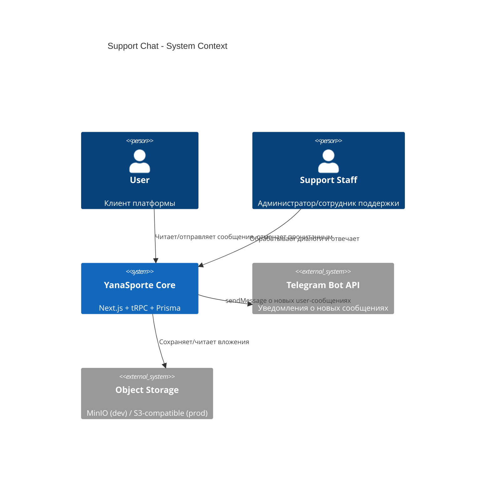
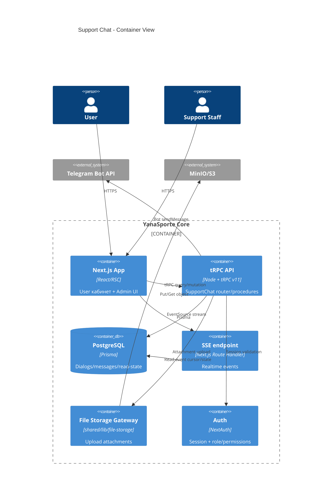
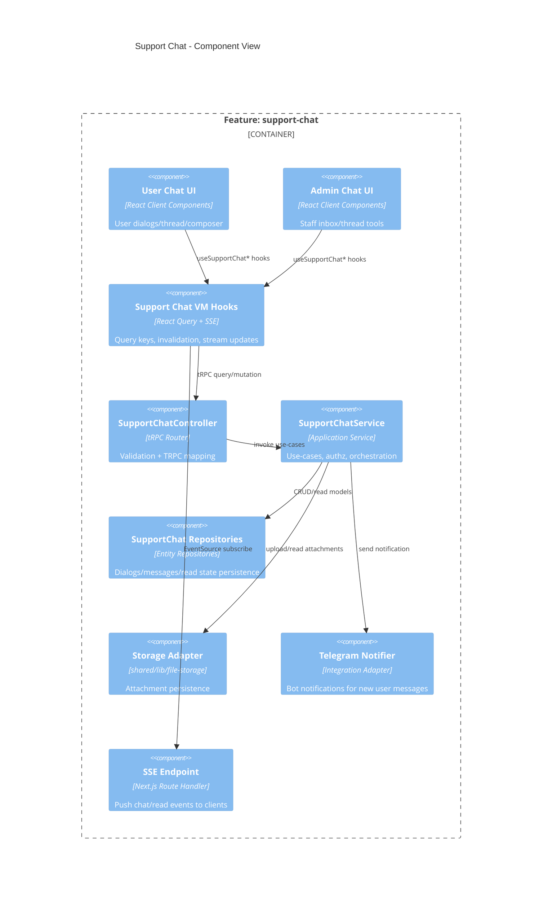
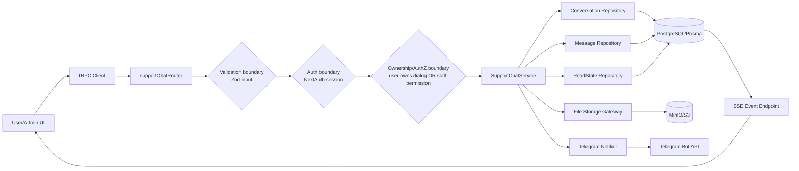
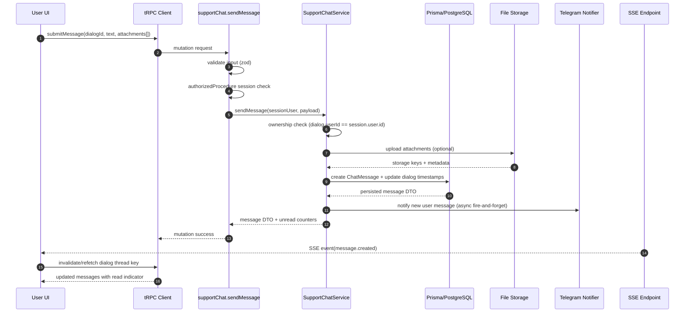
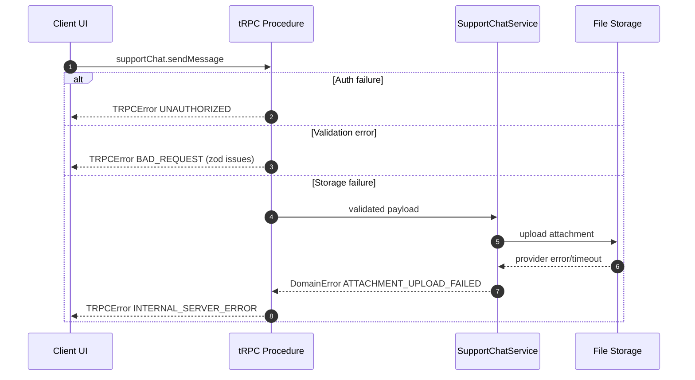

# Design: support-chat

## Summary
Фича добавляет двусторонний чат пользователь <-> поддержка с realtime-доставкой через SSE, вложениями через существующий storage-слой (MinIO в dev / S3-compatible в prod), индикаторами прочтения и визуальной пометкой неотвеченных входящих сообщений в общем staff inbox. API реализуется через новый tRPC-роутер в `features/support-chat`, серверная логика и репозитории разделяются по FSD-слоям, а доступ ограничивается ownership-проверками для пользователя и role/permission-проверками для staff.

## Goals
- G1: Пользователь в личном кабинете может видеть свои диалоги и отправлять сообщения/вложения в поддержку.
- G2: Поддержка в админ-панели видит список всех диалогов, историю сообщений и может отвечать.
- G3: Система обеспечивает realtime-обновление, read-индикаторы, визуальную пометку неотвеченных входящих и отсутствие утечек чужих диалогов.

## Non-goals
- NG1: Полноценный омниканальный inbox (email/WhatsApp/CRM) и маршрутизация тикетов между агентами.
- NG2: Глобальный оффлайн-first sync и push-notifications в браузер/мобильные приложения.

## Assumptions
Only items not proven by research.
- A1: Для staff-доступа будет добавлен отдельный permission-флаг `canManageSupportChats`; `ADMIN` получает доступ без флага.
- A2: На первом этапе один пользователь ведет несколько диалогов, но только с типом `SUPPORT` (без подтипов/категорий SLA).
- A3: SSE будет реализован через Next.js route handler без внешнего message broker; горизонтальное масштабирование обсуждается отдельно.
- A4: Допустимые вложения: изображения/видео/документы до 25MB, whitelist mime-types проверяется на сервере.

## C4 (Component level)

### C4: Context

### C4: Container

### C4: Component

List components and responsibilities with intended file locations:
- UI (features layer)
  - `src/features/support-chat/user-chat/_ui/*`: user dialog list, thread view, composer, read indicators.
  - `src/features/support-chat/admin-chat/_ui/*`: admin inbox list, thread panel, read state indicators, визуальная пометка неотвеченных входящих.
  - `src/features/support-chat/_vm/use-support-chat.ts`: React Query hooks + SSE subscription wiring.
- API (tRPC routers/procedures)
  - `src/features/support-chat/_controller.ts`: `supportChatRouter` с user/staff процедурами.
  - `src/features/support-chat/module.ts`: регистрация контроллера/сервисов в DI.
- Services (use-cases)
  - `src/features/support-chat/_services/support-chat-service.ts`: orchestration (authz, validate, save, notify, event publish).
  - `src/features/support-chat/_services/support-chat-read-service.ts`: mark-read logic и unread counters.
- Repositories (entities)
  - `src/entities/support-chat/_repositories/support-conversation-repository.ts`
  - `src/entities/support-chat/_repositories/support-message-repository.ts`
  - `src/entities/support-chat/_repositories/support-read-state-repository.ts`
- Integrations (kernel/shared)
  - `src/shared/lib/file-storage/*`: upload abstraction и provider selection.
  - `src/features/support-chat/_integrations/telegram-support-notifier.ts`: адаптер к Bot API.
  - `src/app/api/support-chat/events/route.ts`: SSE endpoint.
- Background jobs (if any)
  - На первом этапе не требуются; уведомление в Telegram выполняется синхронно после persistence.

## Data Flow Diagram (to-be)
- UI -> tRPC client -> Router -> Procedure -> Service -> Repository -> Prisma -> External integrations (if any)

Include:
- Validation boundary
- Auth boundary
- Ownership boundary
- Integration boundary

## Sequence Diagram (main scenario)
Numbered steps for the main user journey.
Must include auth check, validation, persistence, side effects, and client update.

### Sequence Diagram (error paths)

## API contracts (tRPC)
For each procedure:
- Name: `trpc.<router>.<procedure>`
- Type: query/mutation
- Auth: public/protected + role/ownership rules
- Input schema (zod): fields
- Output DTO: fields
- Errors: codes and cases
- Cache: query keys + invalidation plan

1. Name: `trpc.supportChat.userListDialogs`
- Type: query
- Auth: protected, user scope (`session.user.id` only)
- Input schema (zod): `{ cursor?: string, limit?: number }`
- Output DTO: `{ items: Array<{ dialogId, title, lastMessagePreview, unreadCount, updatedAt }>, nextCursor?: string }`
- Errors: `UNAUTHORIZED`
- Cache: key `['supportChat','user','dialogs',{ userId, limit }]`; invalidate on `sendMessage`, `markDialogRead`, SSE `dialog.updated`.

2. Name: `trpc.supportChat.userGetMessages`
- Type: query (infinite)
- Auth: protected + ownership of `dialogId`
- Input schema (zod): `{ dialogId: string, cursor?: string, limit?: number }`
- Output DTO: `{ items: Array<{ id, dialogId, senderType, text, attachments, createdAt, readAt }>, nextCursor?: string }`
- Errors: `UNAUTHORIZED`, `FORBIDDEN`, `NOT_FOUND`
- Cache: key `['supportChat','user','messages',{ dialogId, limit }]`; invalidate on `sendMessage`, SSE `message.created`, `markDialogRead`.

3. Name: `trpc.supportChat.staffListDialogs`
- Type: query
- Auth: protected, `ADMIN` или `STAFF` + `canManageSupportChats`
- Input schema (zod): `{ hasUnansweredIncoming?: boolean, cursor?: string, limit?: number }`
- Output DTO: `{ items: Array<{ dialogId, user: { id, name }, unreadCount, hasUnansweredIncoming, lastMessageAt }>, nextCursor?: string }`
- Errors: `UNAUTHORIZED`, `FORBIDDEN`
- Cache: key `['supportChat','staff','dialogs',{ hasUnansweredIncoming, limit }]`; invalidate on staff/user `sendMessage`, `markDialogRead`.

4. Name: `trpc.supportChat.sendMessage`
- Type: mutation
- Auth: protected, user ownership or staff permission to target dialog
- Input schema (zod): `{ dialogId: string, text?: string, attachments?: Array<{ filename, mimeType, sizeBytes, base64 }> }`
- Output DTO: `{ message: { id, dialogId, senderType, text, attachments, createdAt }, dialog: { dialogId, updatedAt }, unread: { user, staff } }`
- Errors: `UNAUTHORIZED`, `FORBIDDEN`, `BAD_REQUEST`, `PAYLOAD_TOO_LARGE`, `INTERNAL_SERVER_ERROR`
- Cache: invalidate dialog list + message thread keys for both audiences; emit SSE event.

5. Name: `trpc.supportChat.markDialogRead`
- Type: mutation
- Auth: protected, user ownership or staff permission
- Input schema (zod): `{ dialogId: string, lastReadMessageId: string }`
- Output DTO: `{ dialogId, readerType: 'USER'|'STAFF', readAt, unreadCount }`
- Errors: `UNAUTHORIZED`, `FORBIDDEN`, `NOT_FOUND`
- Cache: invalidate `dialogs` and `messages` keys for this dialog; emit SSE `read.updated`.

6. Name: `trpc.supportChat.createDialog`
- Type: mutation
- Auth: protected (user)
- Input schema (zod): `{ topic?: string, initialMessage: string, attachments?: Array<{ filename, mimeType, sizeBytes, base64 }> }`
- Output DTO: `{ dialogId, createdAt, firstMessageId }`
- Errors: `UNAUTHORIZED`, `BAD_REQUEST`, `PAYLOAD_TOO_LARGE`
- Cache: invalidate user dialogs, staff dialogs; emit SSE `dialog.created`; send Telegram notification.

## Persistence (Prisma)
- Models to add/change
  - Add `ChatDialog`:
    - `id`, `userId`, `lastMessageAt`, `createdAt`, `updatedAt`.
  - Add `ChatMessage`:
    - `id`, `dialogId`, `senderUserId?`, `senderStaffId?`, `senderType` (`USER|STAFF|SYSTEM`), `text?`, `attachments` (JSONB), `createdAt`.
  - Add `SupportReadState`:
    - `id`, `dialogId`, `readerType` (`USER|STAFF`), `readerUserId?`, `lastReadMessageId?`, `readAt`, `updatedAt`.
  - Change `StaffPermission`: add `canManageSupportChats Boolean @default(false)`.
- Relations and constraints (unique/FK)
  - `ChatDialog.userId -> User.id` (FK, on delete cascade restricted by policy).
  - `ChatMessage.dialogId -> ChatDialog.id` (FK).
  - `SupportReadState.dialogId -> ChatDialog.id` (FK).
  - Unique: one read row per `(dialogId, readerType, readerUserId)`.
  - Check-like invariant at service layer: only one of `senderUserId`/`senderStaffId` must be set according to `senderType`.
- Indexes
  - `ChatDialog(userId, updatedAt desc)` for user inbox.
  - `ChatDialog(lastMessageAt desc)` for staff queue в общем inbox.
  - `ChatMessage(dialogId, createdAt desc)` for thread pagination.
  - `SupportReadState(dialogId, readerType)` for unread calculations.
- Migration strategy (additive/backfill/cleanup if needed)
  - Additive migration: новые таблицы + enum + permission flag.
  - Backfill: не требуется (новый домен).
  - Cleanup: не требуется на этапе запуска.

## Caching strategy (React Query)
- Query keys naming: Define full naming convention
  - `supportChat.user.dialogs`
  - `supportChat.user.messages.byDialog`
  - `supportChat.staff.dialogs`
  - `supportChat.staff.messages.byDialog`
  - `supportChat.dialog.unread`
- Invalidation matrix: mutation -> invalidated queries
  - `createDialog` -> `supportChat.user.dialogs`, `supportChat.staff.dialogs`.
  - `sendMessage` -> обе стороны `dialogs`, соответствующие `messages.byDialog`, `dialog.unread`.
  - `markDialogRead` -> обе стороны `dialogs`, `messages.byDialog`, `dialog.unread`.
- Policy alignment with `docs/caching-strategy.md`
  - Для списков диалогов и сообщений: профиль `FREQUENT_UPDATE` (staleTime 1m).
  - Для справочных значений (статусы/типы): `STATIC`.
  - Realtime strategy: SSE событие инициирует targeted invalidation соответствующих query keys, что уменьшает polling.

## Error handling
- Domain errors vs TRPC errors
  - Domain: `DialogNotFound`, `DialogAccessDenied`, `AttachmentUploadFailed`, `MessageValidationFailed`.
  - TRPC: `NOT_FOUND`, `FORBIDDEN`, `INTERNAL_SERVER_ERROR`, `BAD_REQUEST`.
- Mapping policy
  - Сервис возвращает доменные ошибки как typed exceptions.
  - Контроллер маппит детерминированно: access -> `FORBIDDEN`, validation -> `BAD_REQUEST`, external integration/storage failure -> `INTERNAL_SERVER_ERROR`.
  - Детали внутренних интеграций не раскрываются клиенту; UI получает безопасный message code для toast.

## Security
Threats + mitigations:
- AuthN (NextAuth session usage)
  - Все процедуры `protected`; identity только из `ctx.session.user`, не из input.
- AuthZ (role + ownership checks)
  - User может читать/писать только в `dialog.userId == session.user.id`.
  - Staff доступ только при `role=ADMIN` или `STAFF` с `canManageSupportChats=true`.
- IDOR prevention
  - На каждую операцию с `dialogId` выполняется lookup + ownership/permission check до чтения сообщений.
  - Пагинация сообщений всегда фильтруется по `dialogId`, прошедшему authz.
- Input validation
  - zod schemas для text/topic/attachments; серверный лимит длины текста, размера и количества файлов.
  - MIME whitelist + extension sanitization; запрет пустого сообщения без вложений.
- Storage security (signed URLs, private buckets, content-type/size limits)
  - Bucket приватный; в БД хранится только object key + metadata.
  - Выдача клиенту только через server-side proxy/signed URL с коротким TTL.
  - Проверка `content-type` и size до upload, повторная проверка после upload metadata.
- Secrets handling
  - Telegram token и storage credentials остаются только в server env (`shared/config/private.ts`), не передаются в client bundle.
- XSS/CSRF
  - Message text рендерится как plain text (без HTML injection).
  - tRPC вызовы используют текущую auth cookie + NextAuth CSRF механики для session flows; мутации не принимают небезопасный HTML.

## Observability
- Logging points (controller/service)
  - Controller: audit log на `createDialog`, `sendMessage`, `markDialogRead` с `dialogId`, `actorId`, `actorRole`, `result`.
  - Service: warn/error log при failed upload, failed telegram notify, invalid ownership attempts.
- Metrics/tracing if present, else "not in scope"
  - Custom метрики/trace span для chat пока не внедряются; не в scope этой итерации.

## Rollout & backward compatibility
- Feature flags (if needed)
  - Ввести `ENABLE_SUPPORT_CHAT` (server + UI gate): сначала staff UI, затем user UI.
- Migration rollout
  - Шаг 1: применить Prisma migration (additive).
  - Шаг 2: задеплоить backend router/services + disabled UI behind flag.
  - Шаг 3: включить flag для staff, затем для user.
- Rollback plan
  - При проблемах выключить `ENABLE_SUPPORT_CHAT` (UI/API entry hidden).
  - Схема БД additive, поэтому откат кода возможен без destructive migration.

## Alternatives considered
- Alt 1: WebSocket вместо SSE.
  - Не выбран: SSE проще интегрировать в текущую Next.js архитектуру и достаточно для server->client realtime.
- Alt 2: Хранить вложения прямо в БД (bytea/json).
  - Не выбран: ухудшает размер БД и производительность; в проекте уже есть object storage abstraction.

## Open questions
- Нет открытых вопросов после human review.
- Зафиксировано решение: стартуем с общим inbox для staff без assignment-механики.
- Зафиксировано решение: SLA-статусы не вводим; вместо этого на фронте показываем `hasUnansweredIncoming`.
- Зафиксировано решение: отдельный rate limit для `supportChat.sendMessage` не вводим на этом этапе.
