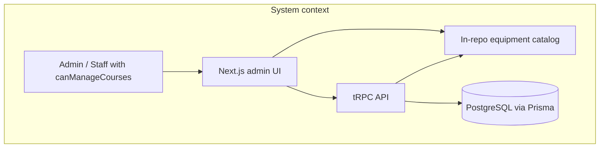
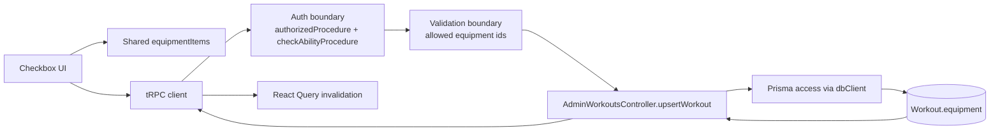
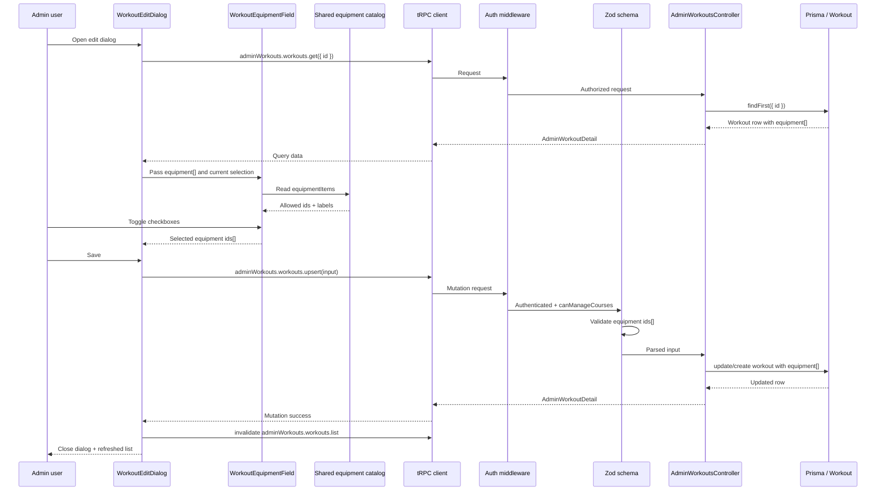
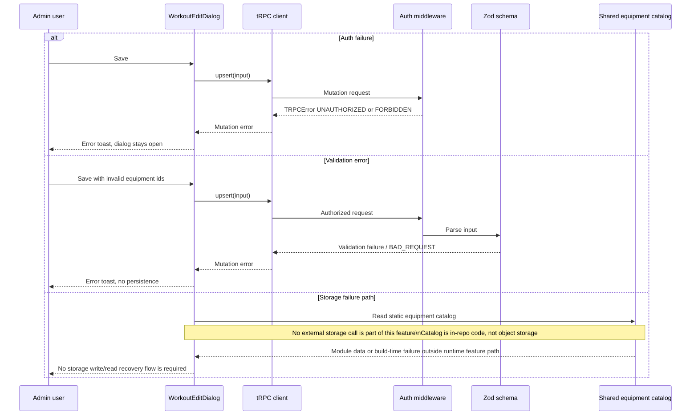

# Design: workout-equipment

## Summary
The feature will replace the current comma-separated equipment text input in the admin workout form with a checkbox-based selector driven by the existing shared `equipmentItems` catalog. The selected values will be persisted in the existing `Workout.equipment: String[]` field as catalog ids from `equipmentItems`, validated against the shared catalog before persistence, and protected by the existing `adminWorkouts.workouts.get` / `adminWorkouts.workouts.upsert` authorization flow based on `canManageCourses`.

## Goals
- G1: Allow admins to select workout equipment through checkbox controls in the admin workout edit form and any existing admin create flow that uses the same upsert contract.
- G2: Make `src/shared/lib/equipment.ts` the single source of truth for allowed equipment values in both UI rendering and server-side validation.
- G3: Preserve the current persistence model and authorization path by storing selected equipment ids in `Workout.equipment` and reusing `adminWorkouts.workouts.upsert`.

## Non-goals
- NG1: Do not redesign the broader admin workouts page, filters, or Kinescope sync flow.
- NG2: Do not introduce a new database table or replace Prisma array storage for workout equipment.

## Assumptions
Only items not proven by research.
- A1: The only admin UI surface for this feature is the researched workout edit dialog; no separate admin workout creation form exists.

## C4 (Component level)
List components and responsibilities with intended file locations:
- UI (features layer): `src/features/admin-panel/workouts/_ui/workout-edit-dialog.tsx` remains the host dialog and delegates equipment selection UI to a new checkbox group component such as `src/features/admin-panel/workouts/_ui/workout-equipment-field.tsx`.
- UI (shared layer): `src/shared/lib/equipment.ts` remains the shared static catalog and additionally exposes a reusable set of allowed ids for validation-friendly consumption.
- API (tRPC routers/procedures): `src/features/admin-panel/workouts/_controller.ts` keeps `adminWorkouts.workouts.get` and `adminWorkouts.workouts.upsert`; the procedure names and router shape stay unchanged.
- API (validation): `src/features/admin-panel/workouts/_schemas.ts` validates `equipment` against the shared catalog ids instead of accepting any trimmed string.
- Services (use-cases): no new standalone service is required; normalization and compatibility mapping stay inside the admin workouts feature layer unless reuse pressure appears later.
- Repositories (entities): no new repository is required; `dbClient.workout` access in `src/features/admin-panel/workouts/_controller.ts` and read mapping in `src/entities/workout/_repositories/workout.ts` remain unchanged.
- Integrations (kernel/shared): existing NextAuth session access, tRPC context, and Inversify bindings remain unchanged in `src/kernel/lib/next-auth`, `src/kernel/lib/trpc`, and `src/features/admin-panel/workouts/module.ts`.
- Background jobs (if any): none; no async job or storage workflow is added by this feature.

```mermaid
flowchart LR
  Admin[Admin user]
  Page[AdminWorkoutsPage\nsrc/features/admin-panel/workouts/admin-workouts-page.tsx]
  Dialog[WorkoutEditDialog\nfeatures admin UI]
  Field[WorkoutEquipmentField\nnew feature UI component]
  Catalog[Shared equipment catalog\nsrc/shared/lib/equipment.ts]
  TrpcClient[tRPC React client\nadminWorkoutsApi]
  Route[/api/trpc route]
  Router[AdminWorkoutsController.router]
  Schema[workoutUpsertInputSchema]
  Persist[upsertWorkout]
  Prisma[(Workout.equipment String[])]

  Admin --> Page --> Dialog --> Field
  Field --> Catalog
  Dialog --> TrpcClient --> Route --> Router --> Schema --> Persist --> Prisma
  Prisma --> Persist --> Router --> TrpcClient --> Dialog
```



## Data Flow Diagram (to-be)
- UI -> shared equipment catalog -> checkbox state -> tRPC client -> router -> auth middleware -> input validation -> controller persistence -> Prisma -> response DTO -> client query invalidation -> refreshed admin list.
- Validation boundary: the client only renders ids from `equipmentItems`; the server validates that every submitted id belongs to the shared catalog before persistence.
- Auth boundary: `authorizedProcedure` and `checkAbilityProcedure` remain the only request-entry auth boundary before any write.
- Ownership boundary: unchanged from current design; writes are permitted by admin capability (`canManageCourses`) rather than per-record ownership.
- Integration boundary: the only added integration in this feature is the shared in-repo catalog module; no external storage or network dependency is introduced.



## Sequence Diagram (main scenario)
1. An authenticated admin or staff user with `canManageCourses` opens the workout edit dialog.
2. The dialog loads the workout via `adminWorkouts.workouts.get` and receives `equipment: string[]`.
3. The checkbox field reads `equipmentItems` and computes checked state by matching workout equipment ids against catalog ids.
4. The admin changes selections and submits the form.
5. The dialog sends `equipment: string[]` containing selected catalog ids through `adminWorkouts.workouts.upsert`.
6. `authorizedProcedure` verifies the NextAuth session.
7. `checkAbilityProcedure` verifies `canManageCourses`.
8. `workoutUpsertInputSchema` validates that all submitted equipment values belong to the allowed id set.
9. `upsertWorkout` persists the validated ids into `Workout.equipment`.
10. The mutation returns the updated workout DTO.
11. The client invalidates `adminWorkouts.workouts.list`.
12. The dialog closes and the workouts list refreshes on the next query cycle.





## API contracts (tRPC)
- Name: `trpc.adminWorkouts.workouts.get`
- Type: query
- Auth: protected; requires authenticated session plus `canManageCourses`
- Input schema (zod): unchanged `id: string`
- Output DTO: unchanged `AdminWorkoutDetail` with `equipment: string[]`; values are treated as equipment catalog ids
- Errors: `UNAUTHORIZED` when no session, `FORBIDDEN` when role/ability check fails, `NOT_FOUND` when workout id does not exist
- Cache: query key remains the generated tRPC key for `adminWorkouts.workouts.get({ id })`; no direct invalidation change required

- Name: `trpc.adminWorkouts.workouts.upsert`
- Type: mutation
- Auth: protected; requires authenticated session plus `canManageCourses`
- Input schema (zod): keep existing fields; change `equipment` to `z.array(z.enum(allowedEquipmentIds)).default([])` or an equivalent refinement using the shared id list so only `equipmentItems.id` values are accepted
- Output DTO: unchanged `AdminWorkoutDetail` with persisted `equipment: string[]`
- Errors: `UNAUTHORIZED` when no session, `FORBIDDEN` when ability check fails, validation error for non-catalog ids, plus existing Prisma write failures surfaced through tRPC error handling
- Cache: on success invalidate `adminWorkouts.workouts.list`; optionally invalidate `adminWorkouts.workouts.get({ id })` when the dialog remains open after save in future flows

- Name: `trpc.adminWorkouts.workouts.list`
- Type: query
- Auth: protected; requires authenticated session plus `canManageCourses`
- Input schema (zod): unchanged
- Output DTO: unchanged list DTO; no new equipment-specific shape required for the table
- Errors: unchanged current auth and transport errors
- Cache: query key remains the generated tRPC infinite query key; invalidated by successful `upsert`

## Persistence (Prisma)
- Models to add/change: no Prisma model change is required; continue using `Workout.equipment: String[]` in `prisma/schema.prisma`.
- Relations and constraints (unique/FK): unchanged; no new relation is introduced because equipment remains a catalog id array stored on the workout row.
- Indexes: no new index is required for this feature because the admin workflow reads and writes by workout `id`, not by `equipment`.
- Migration strategy: no migration is required for the initial feature because the column already exists and supports empty-array/default write semantics at the application layer.
- Backfill strategy: no backfill is planned; the feature does not add compatibility handling for pre-existing non-catalog values.

## Caching strategy (React Query)
- Query keys naming: continue using generated tRPC query keys rooted at `adminWorkouts.workouts.list`, `adminWorkouts.workouts.get`, and `adminWorkouts.workouts.upsert` through `adminWorkoutsApi`.
- Cache class: `adminWorkouts.workouts.list` and `adminWorkouts.workouts.get` remain admin-editable data and should follow the project’s frequent-update posture from `docs/caching-strategy.md`.
- Invalidation matrix: successful `adminWorkouts.workouts.upsert` -> invalidate `adminWorkouts.workouts.list`.
- Invalidation matrix: if a create surface reuses the same mutation and returns to the list, it follows the same invalidation rule.
- Invalidation matrix: `adminWorkouts.workouts.get` does not need forced invalidation in the current close-on-save dialog flow because the form closes immediately after success.
- Real-time update strategy: not in scope; the feature continues using mutation success invalidation rather than subscriptions or polling changes.

## Error handling
- Domain errors vs TRPC errors: authorization remains enforced by existing `TRPCError` middleware; validation failures are raised at the Zod parsing boundary before the controller writes to Prisma.
- Mapping policy: invalid equipment ids should be surfaced as input validation errors; the UI continues to show the existing mutation error toast without adding a separate error transport layer.
- Client behavior: on any mutation failure the dialog remains open and preserves the current checkbox selection so the admin can correct input or retry.
- Compatibility handling: support for legacy non-catalog equipment values is out of scope; the feature targets only catalog-backed selections.

## Security
Threats + mitigations:
- AuthN (NextAuth session usage): keep the existing `SessionService` + `authorizedProcedure` flow; no client-side-only gate is trusted for writes.
- AuthZ (role + ownership checks): keep `checkAbilityProcedure` with `ability.canManageCourses`; no new route should bypass `adminWorkouts.workouts.upsert`.
- IDOR prevention: continue route-level admin capability checks before `get` and `upsert`; this feature does not introduce record ownership semantics and does not expand the accessible record set beyond the existing admin surface.
- Input validation: the client restricts choices to catalog ids rendered from `equipmentItems`, and the server independently validates each submitted id against the same catalog-derived allowlist.
- XSS: equipment labels and descriptions come from static in-repo code and are rendered as plain text in React; no HTML rendering is introduced.
- CSRF: mutations continue through the existing authenticated tRPC/NextAuth session model; no new form post endpoint is introduced.
- Storage security (signed URLs, private buckets, content-type/size limits): no storage read/write is added by this feature; object storage protections remain unchanged and out of the request path.
- Secrets handling: no new secrets are introduced; the feature reuses existing server-side config and shared static code only.

## Observability
- Logging points (controller/service): reuse the existing controller logging style only for unexpected persistence errors; no new structured log is required for successful equipment updates.
- Metrics/tracing if present, else "not in scope": not in scope; the current feature does not introduce new metrics or tracing instrumentation.

## Rollout & backward compatibility
- Feature flags (if needed): no feature flag is required if the checkbox field fully replaces the current text input in the same dialog.
- Migration rollout: ship UI and server validation in one release so the client and server both operate on catalog ids.
- Backward compatibility: the feature does not preserve or specially handle legacy non-catalog values; runtime behavior is defined only for catalog-backed ids.
- Rollback plan: revert the UI field to the previous text input and revert server validation to generic `z.array(z.string().trim())` while keeping the database unchanged.

## Alternatives considered
- Alt 1: Keep the current comma-separated text input and add only server validation. Rejected because it does not satisfy the brief requirement for checkbox-based selection and keeps manual input errors in the UI path.
- Alt 2: Normalize equipment into a dedicated Prisma table with relations. Rejected for this feature because the existing `String[]` field already supports storage, and a relational redesign is outside the requested scope.

## Open questions
- None after design review. The approved scope is limited to the existing admin workout edit dialog, and legacy non-catalog equipment value support is out of scope.
