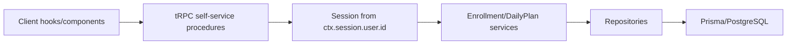
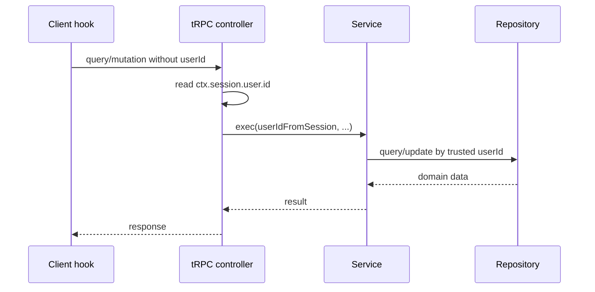

# Design: self-service-userid-idor

## Summary
Self-service маршруты `course-enrollment` и `daily-plan` должны перестать принимать `userId` от клиента как authority source. Целевой дизайн убирает `userId` из client-facing input DTO и в контроллерах берет user identity только из `ctx.session.user.id`. Для `updateWorkoutDays` добавляется explicit ownership check по `enrollment.userId === ctx.session.user.id`.

Изменение ограничено self-service flows. Admin/profile routes, где `userId` нужен для управления другим пользователем и уже защищен ability middleware, остаются без изменений.

## Goals
- G1: исключить IDOR по spoofed `userId` в self-service tRPC процедурах.
- G2: исключить запись в чужой enrollment через произвольный `enrollmentId`.
- G3: сохранить существующий UX, SSR hydration и React Query invalidation без изменения бизнес-логики.

## Non-goals
- NG1: не переписывать admin flows, где `userId` используется осознанно и защищен ability checks.
- NG2: не менять Prisma schema и не вводить миграции.
- NG3: не реорганизовывать сервисный слой вне минимального security scope.

## Component C4

Components:
- UI:
  - `src/features/course-enrollment/_vm/use-course-enrollment.ts`
  - `src/features/daily-plan/_vm/use-daily-plan.ts`
  - `src/features/daily-plan/_vm/use-workout-completion-status.ts`
  - `src/features/daily-plan/_ui/exercise-card.tsx`
  - responsibility: invoke self-service queries/mutations without passing `userId`
- API/controllers:
  - `src/features/course-enrollment/_controller.ts`
  - `src/features/daily-plan/_controller.ts`
  - responsibility: derive acting user from `ctx.session.user.id`; enforce enrollment ownership for `updateWorkoutDays`
- Services/repositories:
  - existing service/repository contracts remain unchanged and still accept `userId`, but that user id now originates only from server session in self-service flows.

## To-be data flow
Client hook/component -> tRPC query/mutation without `userId` -> `authorizedProcedure` -> controller reads `ctx.session.user.id` -> service/repository -> Prisma -> response

For `updateWorkoutDays`:
Client mutation -> controller loads enrollment by id -> compare `enrollment.userId` with `ctx.session.user.id` -> allow update or throw `FORBIDDEN`

## Sequence diagram

## tRPC contracts
### CourseEnrollmentController
- `course.getEnrollment`
  - before: `{ userId: string, courseId: string }`
  - after: `{ courseId: string }`
- `course.getEnrollmentByCourseSlug`
  - before: `{ userId: string, courseSlug: string }`
  - after: `{ courseSlug: string }`
- `course.checkAccessByCourseSlug`
  - before: `{ userId: string, courseSlug: string }`
  - after: `{ courseSlug: string }`
- `course.getUserEnrollments`
  - before: `{ userId: string }`
  - after: no input
- `course.getActiveEnrollment`
  - before: `{ userId: string }`
  - after: no input
- `course.getUserWorkoutDays`
  - before: `{ userId: string, courseId: string }`
  - after: `{ courseId: string }`
- `course.getAvailableWeeks`
  - before: `{ userId: string, courseSlug: string }`
  - after: `{ courseSlug: string }`
- `course.updateWorkoutDays`
  - input unchanged
  - new behavior: throws `TRPCError({ code: 'FORBIDDEN' })` when enrollment belongs to another user

### WorkoutController
- `getUserDailyPlan`
  - before: `{ userId: string, enrollmentId: string, courseId: string, dayNumberInCourse: number }`
  - after: `{ enrollmentId: string, courseId: string, dayNumberInCourse: number }`
- `updateWorkoutCompletion`
  - before: `{ userId: string, workoutId: string, enrollmentId: string, isCompleted: boolean, contentType, stepIndex }`
  - after: `{ workoutId: string, enrollmentId: string, isCompleted: boolean, contentType, stepIndex }`
- `getWorkoutCompletionStatus`
  - before: `{ userId: string, workoutId: string, enrollmentId: string, contentType, stepIndex }`
  - after: `{ workoutId: string, enrollmentId: string, contentType, stepIndex }`

## Prisma/storage changes
- Prisma schema changes: none
- Migrations: none
- Storage changes: none

## Caching & hydration impact
- React Query keys for the affected self-service procedures change because `userId` is removed from input.
- Server hydration in `src/app/platform/(app-shell)/(paid)/day/[courseSlug]/page.tsx` must set query data with the new input shapes so client and server cache keys match.
- Invalidation calls can remain broad (`invalidate()` without input) where already used.
- For workout completion UX, `getWorkoutCompletionStatus` should be the single client-side source of truth for `ExerciseCard`; optimistic UI should update that query cache via mutation lifecycle (`onMutate/onError/onSettled`) instead of duplicating completion state in local component state and external store.

## Security
### Threats
- T1: authenticated user sends чужой `userId` to self-service procedure and reads чужой access/enrollment/daily plan
- T2: authenticated user sends чужой `userId` to mutation and updates чужой workout completion
- T3: authenticated user sends чужой `enrollmentId` to `updateWorkoutDays`

### Mitigations
- M1: remove `userId` from self-service client/server input contracts
- M2: source acting user only from `ctx.session.user.id` inside controllers
- M3: add explicit ownership check for `updateWorkoutDays`
- M4: keep admin/profile routes unchanged where `userId` is intentionally part of the contract and guarded by ability middleware

## Acceptance criteria
- Self-service client hooks no longer accept `userId` as argument.
- Self-service tRPC procedures no longer accept `userId` in input.
- `updateWorkoutDays` rejects non-owner enrollment updates with `FORBIDDEN`.
- SSR hydration on day page still matches client query keys.
